<!-- Generated by scripts/compile.py. Do not edit by hand. -->
<!-- Coverage: prologue, introduction, PART I opening, ch01, ch02, ch03, ch04, ch05, PART I closing plate, PART II opening, ch06, ch07, ch08, ch09, ch10, ch11, PART II closing plate, PART III opening, ch12, ch13, PART III closing plate. Chapters: 13 of 13 in range 1-13. -->
<!-- Precursors: prologue, introduction. Part openings: 3 of 3 crossed. Built: 2026-09-24-0144. -->
<!-- Plates: ch01=DRAFT, ch02=DRAFT, ch03=DRAFT, ch04=DRAFT, ch05=DRAFT, PART I=landed, ch06=DRAFT, ch07=DRAFT, ch08=DRAFT, ch09=DRAFT, ch10=DRAFT, ch11=DRAFT, PART II=landed, ch12=DRAFT, ch13=DRAFT, PART III (after ch13; Part incomplete)=DRAFT. Missing: none. -->
<!-- Unapproved chapter runs: [13]. -->

# Prologue

Marriage is hard. Everyone who's been in one for real knows this. It's also one of the best things a life can hold, and everyone who's been in a good one knows that too. Both are true at the same time, all the way through.

Men are strong in a lot of places. You've probably been told this your whole life, and in most of those places it's earned. You show up at work under pressure. You lift the heavy thing. You take the hit, keep your head, get the job done. Whatever field you chose, someone taught you how to be good at it. There was a coach or a mentor or a book or ten years of showing up. There was a blueprint. You followed it, and you got stronger.

Nobody handed you the blueprint for being a husband. Nobody hands it to anyone. There's no coach, no clean set of drills. Your dad had ideas, and some of them were good and some of them weren't, and you absorbed both without deciding which was which. TV husbands are cartoons. Your friends look like they've got it figured out from a distance, and when you get closer you find out most of them are guessing too. Everyone acts like they know what they're doing. Most men, if they're honest, are quietly making it up as they go.

I was in the same boat. Same as you. And that was fine. Until it wasn't.

My wife and I met in the fifth grade. We were best friends by sixth. We started dating late in tenth grade, and we got married the first year out of college. We're over thirty years in. I mention that as a data point, not a brag. It means whatever I say about marriage in this book, I've had it tested on me more than once.

We're different in a lot of ways. She's structured, methodical, organized. She thinks in outlines and files. I'm the other one. I see three moves ahead and skip the paperwork, which is a nicer way of saying I don't do the paperwork at all. But we're not opposites. We're both competitive. We both care, deeply, about the same thing: this family actually working. We just go after that from completely different directions, and we've been working at it together, some seasons well and some seasons badly, for a very long time.

We've worked at the same company under the same boss, competing for the same bonus, which is a marriage stress test they don't put on the brochure. She went to law school a few hours away, and I made the drive most weekends to keep us close, until she transferred somewhere nearer.

Later I left a steady job to start a company. For about ten years, we lived mostly on her income while the business found its footing. She was building a real career as an attorney. I was building something with no guaranteed paycheck, while we were also raising kids. Figuring out who did what, and why, and making it work, took real effort. It wasn't the setup either of us grew up picturing. We built it as we went. We've raised three kids together, both of us working full time the whole time, from diapers up through a house full of teenagers. My oldest starts his senior year of high school in the fall. Neither of us has met the version of ourselves that isn't tired.

We've both buried a parent young, at different points along the way. My dad. Her mom. Nothing prepares you for what that does to a marriage, and nothing prepares you for how differently grief lands on each of you when it's your turn to carry it.

None of that made me a good husband. It made me an experienced one. Those are different things.

A few years back I hit a stretch that had no single cause and no clean edge. Work was heavy. Home was heavy. There was no line between the two anymore. I wasn't in a crisis anyone could point at, which somehow made it worse, because there was nothing to blame it on except the general shape of my life. I started reading. Not to fix anything specific. Just to try to find some ground under my feet.

I fell into the history of philosophy. Somewhere in that reading I hit a question that stopped me cold. I still can't tell you exactly who said it or where I saw it. It was something like: where does a man go to find a blueprint for a good life? I sat with it for a long time. I couldn't answer it. I didn't have one. I'd been running the same imported blueprint everyone else was running, and I'd never once stopped to ask whether it was mine.

I've been the kind of person who chases that question my whole life. As a kid, I started riding to church with a neighbor around age nine, and I kept going for years. My parents never came. It wasn't a family thing. It was mine. When Mormon missionaries came by the house, I invited them in and heard them out. I was curious about how other people build frameworks for how to live. I still believe in God. That part didn't go away. But the search for a working blueprint for how to actually be a man in a marriage? That part was still open.

Stoicism grabbed me for a specific reason. It wasn't asking me to accept anything I couldn't test. Faith asks you to trust something before you've seen it. Stoicism asks you to look hard at what's actually true and then act on it. That was the same posture I'd learned in business. It was also what I'd found years earlier, reading Stephen Covey's The 7 Habits of Highly Effective People. That book was where I first realized the rigor I used at work could apply to how I lived generally. Stoicism gave me a version of that same rigor, older by two thousand years, with sharper teeth.

You may already have an idea in your head about what a stoic man looks like. Cool, quiet, unbothered. A little cold. That's the version most people carry, and it isn't what the Stoics were teaching. Stoicism works like lifting, or running a company, or learning an instrument. You build it through practice, not because you were born with the right temperament for it. You don't have to be born calm to build it. You build it by doing it, on purpose, over and over, until the habit is the man.

Which brings me to the mistake I want you to know about now. This whole book was written to keep you from making it.

Early on, I took one piece of the philosophy and ran it too far. Stoicism teaches you to stop spending energy on things you can't control. I got good at that fast, at work, with money, with setbacks. I got calmer. I got harder to knock off balance. Then, without really noticing, I started applying the same logic to my wife. Her mood, her feedback, the things she was upset about. I filed all of it under "not up to me" and stayed serenely above it. I thought I was getting stronger. I was actually getting really good at not being fully present in my own marriage.

She noticed before I did. She told me, in her own words, that I'd gone somewhere she couldn't follow me to. She was right. I'd built something invulnerable and called it growth. Nothing I was doing looked bad from the outside. From the inside of the marriage, it was a slow quiet distance she couldn't name and I wouldn't admit to.

It took me a while to understand what I'd gotten wrong. Several of the Stoic philosophers were husbands and fathers themselves. They wrote to stay clear-headed inside their obligations, not to float above them. I'd been applying the philosophy everywhere in my life except the one place it actually needed to go. A reachable man is the strong one. A man who's found a quiet way to disappear from his marriage looks calm from the outside and is doing damage on the inside.

If picking up a book like this feels like admitting you don't have it all figured out, I want to address that directly. Every man worth knowing has needed help with something. A coach. A mentor. A hard book. A hard conversation with somebody further down the road. That's not weakness. That's the shape of building anything real. The men I respect most are the ones who kept looking for the answer instead of pretending they already had it.

None of this works if only one person is doing it. A marriage takes two people fully in it, both willing to put in real effort. This book focuses on your half of it, the half a man actually controls, simply because that's where I have something useful to say. If neither of you is investing in this marriage, that's a real problem. If only one of you is, it's still a problem, just a smaller one, and in my experience, one person doing this work seriously tends to change what becomes possible for the other. A lot of men skip this kind of work entirely because somewhere along the way they got the idea that a real man just handles his marriage without help, that needing to work on it is a sign of weakness. I've never met a man who believed that and was actually good at this. It takes real effort, sustained over years. Skipping it is the easy way out.

This is a partnership. I want to be clear about that before saying anything else here. But a partnership still needs someone willing to go first. Waiting to see what she does before you commit to your own side just delays things for both of you. If you want a marriage that's actually great, invest in it on your own initiative, regardless of what she's doing with her half. That's what leading means in this book. Going first. First with the repair after a bad night. First with the honest sentence. First with the choice, on the days it doesn't feel worth it, to invest anyway. You can only ever be responsible for your own half of this. Doing yours fully, whether or not she's watching, is the whole job.

People will tell you love should come naturally. That if you're working this hard at your marriage, something is wrong. I disagree. Every strong marriage I've been close to is hard. Every marriage I've watched fall apart was also hard. The difference wasn't the difficulty. It was what the difficulty was building, or not building.

You don't get to skip the hard part in anything that actually matters. Skip the gym today, and it's easy, right up until your body can't do what you need it to when it counts. Spend everything you make, and today feels easier, right up until the year you actually needed something saved and there's nothing there. The jelly donut runs on the same math: fast and easy now, slow and hard later, on all the days the weight won't come off. Marriage runs on the same math. You don't get to skip the hard part. You only get to choose which hard part you build something with. You choose your hard.

So this book is about the hard part I chose to build with.

I was in the same boat you're probably in. I built the boat while I was in it, one ordinary day at a time, over thirty years, with no shortcuts and nothing dramatic to point to. If this book gives you a head start on some of that time, that's the whole point.

You can start building before it stops being fine.

# Introduction: The Man Without a Blueprint

## The River, the Oak, and the Sun

A great husband is not defined only by what he provides. He is also defined by what it feels like to live beside him.

Does his presence bring peace or tension? When life changes, does he become rigid and resentful, or does he help his family find a way forward? When hardship comes, does he become another burden to carry, or does he become someone others can lean on? And when the hardship passes, does he know how to laugh, touch, flirt, celebrate, and make his wife feel deeply loved?

A husband must learn to embody three qualities:

The adaptability of the river.
The strength of the oak.
The warmth of the sun.

Together, they form a blueprint for calm, dependable, and loving masculinity.

## River: Calm and Adaptable

The river is calm, but it is not weak. It does not waste its power fighting every stone in its path. It accepts the landscape, adapts to it, and continues moving in the same direction.

Marriage will not follow the course you imagined on your wedding day. Careers will change. Children will reshape your life. Bodies will age. Plans will fail. Illness, grief, disappointment, and uncertainty will alter the terrain.

The river does not demand that the world remain unchanged. It learns how to keep flowing through what has changed.

To possess the quality of the river is to govern yourself before attempting to govern the moment. It is to resist turning every inconvenience into a crisis, every disagreement into a battle, and every emotional reaction into a verdict.

Your family should not have to fear your moods. Your wife should not have to manage your ego before she can discuss a problem with you.

Calm does not mean feeling less. It means feeling deeply without allowing every feeling to take command. A husband should be steady enough that his marriage can move through difficulty without being damaged by his reaction to it.

## Oak: Strong and Dependable

The oak stands when the weather turns against it. Its roots go deeper than the storm, and its strength does not need to be announced. It is revealed when weight is placed upon it.

To possess the quality of the oak is to become dependable. It means telling the truth when deception would be easier, keeping your word when your feelings have changed, and carrying responsibility without demanding applause. It means protecting the dignity of your wife and the stability of your home.

There will be seasons when your wife is tired, afraid, grieving, or unable to carry what she normally carries. There will also be seasons when you are the one who is wounded.

Strength does not mean pretending you never hurt. It means refusing to use your pain as an excuse to become cruel, dishonest, absent, or irresponsible.

A strong husband is not one who controls everyone around him. He is one who can be trusted with power, anger, hardship, temptation, and disappointment. When life becomes heavy, his family knows he will not disappear beneath the weight.

He becomes load-bearing.

## Sun: Warm and Life-Giving

A house can be structurally sound and still feel cold.

That is why strength and calm are not enough. A husband must also bring warmth.

Many men learn how to provide, protect, solve, and endure. Far fewer learn how to make love visible. They assume loyalty should be understood, sacrifice should speak for itself, and years of work should automatically make their wives feel loved.

But love that is never expressed can begin to feel like indifference.

To possess the quality of the sun is to bring warmth deliberately. It is to praise your wife without being prompted, touch her as you pass, remain curious about her, flirt with her after years of marriage, and create moments of play, beauty, desire, and joy.

Warmth is not weakness. Romance is not frivolous. Tenderness does not diminish a man's strength. It gives his strength a purpose.

Your wife should experience more than your discipline, reliability, and restraint. She should experience your delight in her. She should know not only that you would defend her, but that you enjoy her. Not only that you intend to remain married to her, but that you continue to choose her.

Make your affection unmistakable.

## The Danger of Becoming Only One

The incomplete husband embraces one quality while neglecting the others.

The river without the oak becomes passive. He adapts to everything because he stands for nothing.

The oak without the river becomes rigid. He mistakes stubbornness for conviction and control for strength.

The oak without the sun becomes cold. He provides shelter, but no one feels warmth beneath his branches.

The sun without the oak becomes unreliable. His affection is bright when life is easy, but disappears when love requires sacrifice.

The sun without the river becomes volatile. His passion may be powerful, but his emotions govern the home.

A great husband must embody all three:

Calm enough to adapt.
Strong enough to endure.
Warm enough to love openly.

## The Standard

When life changes, flow.

When life becomes heavy, stand.

When life becomes ordinary, bring warmth.

Ordinary days are where most marriages are either nourished or neglected. Your wife does not need a flawless man. She needs a man who can remain grounded without becoming rigid, composed without becoming distant, and loving without becoming weak.

She needs a man whose presence says:

We can face what is coming.

You do not have to face it alone.

And even here, even now, there is still warmth between us.

The river teaches him to adapt without losing direction.

The oak teaches him to carry weight without losing himself.

The sun teaches him to love in ways that can be felt.

Flow with wisdom.
Stand with courage.
Love with warmth.

# PART I — THE STEADY RIVER

*The river is steady. Things get thrown into it all day and the current keeps its pace. It doesn't fight the stone in its path. It goes around it, and it goes on. It takes the landscape as it finds it and holds its direction anyway. It's patient enough to cut a canyon out of rock, one ordinary day at a time.*

# Chapter 1: The Three-Second Window

Between the moment she says something and the moment you respond, there's a window. Most men don't know it's there. The ones who learn to use it become a different kind of husband.

She says something sharp. Maybe it's about the dishes, or your tone from an hour ago, or the thing you forgot again. The content doesn't matter. None of it does. What matters is what happens next. That half-second where you're still somewhere between deciding and reacting. And then the two and a half seconds after, when you stop deciding and just fire.

The words are already out before you've finished thinking them. She's somewhere else now. The night was fine two minutes ago. Now it's something else entirely.

You know the rest. You've lived the rest.

That night you're lying in bed. She's there, but something is in the room that wasn't there an hour ago. You're not sleeping. Your mind is already replaying it. The exact moment the window opened. What you did with it. What a different choice would have looked like, and where the night would have gone.

That three-second window is what this book is about.

Not the big fights. Not the hard years or the good ones. The window. Who you are in those three seconds is the husband you've been becoming, mostly without knowing it.

**The Gap**

Here's what actually happens, in order.

Something lands. She says something, or doesn't say something, or you catch her face doing a particular thing. On its own, that's just data: a sound, a look, a silence.

But it never arrives on its own. It lands on something already there. A thing you're sensitive about. A story you carry about what this kind of moment usually means. Baggage you picked up somewhere along the way. The thing plus the baggage produces a feeling, instantly, before you've had a single conscious thought. And that feeling already comes with meaning attached. It already says "she's disrespecting me" or "here we go again" or "I can't do anything right in this house." You didn't decide that meaning. It just showed up already finished, the way a smell arrives before you choose to notice it.

Then comes the response. For most men, most of the time, this part runs on its own too. The tone shifts. The comment fires. The silence starts, and it's a particular kind of silence, the kind that has something behind it. None of this was decided. It happened the way it's happened before, the way you've watched it happen in someone else.

Trigger. Loaded meaning. Automatic response. Run that sequence enough times, on enough different triggers, and you get something like an operating system. A set of defaults that decide, without your input, what things mean and what you do about them. Some men got a pretty mild one. Most things don't carry much weight, and most of the responses are small. Some men got a rough one. Small things carry enormous weight, and the response matches. Almost nobody picked theirs. It's just what got installed.

There's a gap between the second step and the third. Between the meaning showing up and the response firing. It's real, even on the nights it doesn't feel real, even when it's three seconds or less. Epictetus had a word for the loaded thing that shows up first: he called it an impression, an appearance in the older translations. And he had a word for the part of you that can sit in that gap for a moment before the response fires: *prohairesis*, your faculty of choice. Most of us never use it. We let the impression go straight through to the response, the same way it always has. "Appearances, wait for me a little," he told himself, when an impression hit hard. "Let me see who you are, and what you are about; let me put you to the test." (*Discourses* II.18, Long trans.) That's the whole move. Not denying what just landed. Just not letting it drive yet.

There's a physical version of that pause. Before you respond, take one breath. Not a sigh she can hear, not a performance. Just one breath, in and slow out, before any words come. It's hard to fire on autopilot and breathe on purpose at the same time. Use that. Some nights it's easier than others. When you're under-slept, or already carrying something from earlier in the day, the gap is smaller and the breath is harder to remember. It's still there.

Where did the meaning come from, the baggage that turns an ordinary comment into a trigger? Some of it is yours alone. A lot of it, you picked up the same place you picked up the response. Watching someone else live this exact sequence, your whole life.

**What Got Installed**

I've been married twenty-three years. I applied Stoic philosophy to my work, my training, how I showed up under pressure in every arena. Everywhere except the one that mattered most. I'm not writing this because I figured it out early. I'm writing this because I didn't.

My grandfather was devoted to my grandmother. Fifty-plus years, and no one who knew them doubted it. He was also the head of that household, and nobody questioned it. That was the world they both lived inside. He also had a three-second window of approximately zero.

He ran a small business for most of his life. Grandma worked for him. When something went wrong, the yelling came before the thought. Not occasionally. That was just how he operated. The people around him read it as authority. The man in charge, making clear he was in charge. When he retired he became a rancher. Same thing. Too slow or wrong, you got a tongue lashing: full volume, swearing, no filter. Grandma got it too. She'd pull in and go quiet. They went on.

My father watched this and wanted to be that man. The one who led, who didn't back down. But he had a different wife, one who wasn't going to go quiet, and the pattern escalated. What had been a raised voice became a screaming match. What had been sharp words became broken things. He never hit my mother. But he filled the gap with everything else available. Afterward, there was no repair. Just days of cold, and then time, and then routine, and then the next one.

I watched all of it. I was taking notes I didn't know I was taking.

My mother's pattern ran in two directions. When things got hard, she'd go quiet. Not for hours but for days. She'd replay the fight, hold on to the hurt, come back to it. That silence pushed my father further into his anger. His anger pushed her further into silence. A loop. But she could also engage, and when she did, the words were precise and cutting in a way that yelling never is. She knew where it would hurt most.

I don't yell. I don't break things. But I can sulk, and I can find that sentence. That's the thing about the gap. It doesn't come empty. If you haven't decided what goes in it, something else already has.

**The Inward Turn**

I had all of this in me too, even with the philosophy. Then one night, lying awake long after the house had gone quiet, replaying it, it hit me. I'd never once asked myself, afterward, whether I'd shown up as the husband I actually wanted to be. I'd just moved on. Onto the next thing, the next day, the next round.

So I started asking. Not in the moment. After. Lying there in the dark, replaying what had happened: *Was I being the best husband I could be?*

Not *who's right*. Not *did she deserve that*. Not *is this fair*. Those questions matter, and they have their place, but not here. This question does something the others don't: it stops asking what she did and starts asking what you did. From the territory you don't govern to the only territory you do.

Not a feeling. Four things, and when you replay the moment, ask them as if you're still standing in it:

**Logical.** Wisdom is the classical word for it. Are you thinking clearly, or reacting to an impression you haven't examined? Does this moment actually require what you're about to do, or have you already decided and you're just executing it?

**Kind.** The Stoics called this justice: are you acting from genuine care for this person and this marriage, or from ego? From the score you've been keeping? From a fight you were already inside before she said a word?

**Self-controlled.** Temperance. Are you governing this impulse before it fires, or have you decided that what you feel is what needs to happen?

**Brave enough to stay engaged.** The fourth is courage. Are you here? In this room, in this moment, reachable? Or are you leaving? Through your words, or your silence, or the thing you're about to say to end this.

Save this for afterward, not mid-fight. Walk through it then. Ask it honestly, and you already know most of the answers. You usually do.

In the moment itself, there's room for something smaller. One breath, and one quick question: *What's this actually about for me right now, and how do I want to respond?* That's it. The breath buys the half-second. The question loosens whatever just got loaded. You don't need the full four-part review while she's standing in the doorway. You need it later, lying awake, training the thing that fires automatically next time.

The rest of this book unpacks those four things in every specific situation a marriage hands you. The replay question doesn't change. Neither does the breath.

**The Mistake I Made First**

Having the question didn't mean I used it well right away. The first time I really leaned on a piece of Stoic doctrine in my marriage, I got it backwards.

I'd learned the dichotomy of control, one of Stoicism's foundational ideas: you control your own thoughts, choices, and responses. You don't control anyone else's. That part is true. What I did with it wasn't.

When she'd get upset, I'd step back mentally. *I can't control her. I can only control me.* Then I'd go calm, go quiet, and wait for it to pass. From the inside, this felt like progress. I had learned not to react. I was finally doing the thing.

My wife thought I'd gone somewhere she couldn't reach.

She wasn't wrong. "I can only control me" had become a way to opt out. Her frustration, what she needed from me in that moment. I'd filed it under *not mine to deal with*. Equanimity means staying calm and steady on the inside, no matter what's happening around you. What I'd done wasn't that. It was an excuse to disappear, and I'd called it progress. The Stoics called for self-command. I'd built self-removal instead.

The fourth virtue is on the list for exactly this reason. *Brave enough to stay engaged.* The gap is where you step toward what's hard, and stay in the room. The Stoic Husband stays reachable. He's learned to pause in the place most men fire from. That pause takes more presence than distance ever could.

She's been waiting for someone to come home who isn't just riding it out.

**You Own This**

Marcus Aurelius was a Roman emperor. For years, he lived away from home, leading his army through wars he didn't choose. He was governing an empire and losing people he loved. The whole time, he wrote himself notes. Not for anyone else to read, not for history. Just reminders, written in the middle of everything else. That he had power over his own mind, whatever was happening outside it. That this was where whatever strength he had left would have to come from. A man in a hard season, reminding himself of the one thing he still owned.

You own the window. Three seconds, Tuesday night, both of you tired. The night goes wherever you take it.

Use it.

---

<figure class="plate">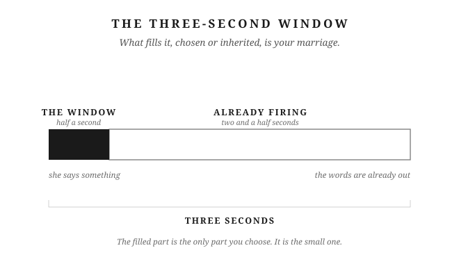</figure>

## Putting It Into Practice

1. Before you respond, take one breath. While you do, ask yourself one question: *What's this actually about for me right now, and how do I want to respond?* That's the whole practice. The breath buys the time. The question loosens whatever just got loaded.
2. That night, or the next morning, walk back through what happened and ask, *Was I being the best husband I could be?* Go through the four: logical, kind, self-controlled, brave enough to stay engaged. Where did you fall short? What would a different choice have looked like?
3. Name one thing that reliably triggers you, and the automatic response you run when it fires (getting dismissed, feeling unappreciated, a comment that lands on something you're sensitive about). Write down both the trigger and the response. That's the pattern you're practicing against.

# Chapter 2: Stop Outsourcing Your Peace

Chapter 1 gave you a gap: the three-second window between what happens and what you do about it. This chapter is about what's been filling that gap for years, without you ever signing off on it.

Epictetus was a Stoic teacher who spent his early years as a slave and his later years running a school. His *Enchiridion*, a short field manual for Stoic living, opens with a line most people read once and never apply:

*"Of things some are in our power, and others are not. In our power are opinion, movement towards a thing, desire, aversion, turning from a thing; and in a word, whatever are our acts. Not in our power are the body, property, reputation, offices (magisterial power), and in a word, whatever are not our own acts."*
— Epictetus, *Enchiridion*, Ch. 1 (Long trans.)

Study that list. Her mood isn't on either side. Not her state of mind. Not the energy she carries through the door. Not the temperature in the house when she walks in. None of it appears. Not because Epictetus overlooked it. Because other people's inner states were never yours to work with. They were never on the list because they were never yours.

Your wife comes home from catching up with a friend and you can tell before she's through the door. She's lit up. She gives you a hug, a quick kiss on the cheek, and your whole night lifts. You didn't decide to feel that. You just do.

The reverse is just as automatic. She walks in distracted, or quiet, or carrying something heavy from a long day. Not a fight, nothing said: just the weather off her. Something in you shifts before she's said a word.

You've probably never named this. It just runs. And if you haven't named it, you definitely haven't governed it.

---

**The human mirror.**

When someone laughs, you laugh. When someone winces, you feel a shadow of it. Walk into a room full of nervous people and your own chest tightens before you've identified a single reason. Call it emotional contagion: the unconscious, automatic transfer of emotional states between people. It moves through facial expressions, through tone of voice, through posture, faster than thought.

The deeper the bond, the stronger the pull. You've built a life with this woman. Your history is her history. Feeling her is part of that connection, and it's not going anywhere.

Mirroring is what turns it into a problem. Feeling her mood is one thing. Becoming it is another. She comes in low and now you're low. She comes in tense and now the whole evening bends around it. You didn't decide any of that. It just happened. Left alone, it runs the house.

---

**The cascade.**

You've had the kind of day you can feel in your shoulders. You walk through the door still carrying it. She says something. It lands wrong. You snap. Nothing dramatic. Just edges.

She carries that into the kitchen where the kids already are. The tone she brings them isn't the one she started the day with. The kids catch it. Pass it. The youngest, running out of targets, kicks the dog.

The dog did nothing.

Your ungoverned arrival. An entire household in distress. Ending with an animal who had no part in any of it. Nobody decided to pass it along. It moved on its own, the way these things do. It didn't stop until it ran out of people.

Nobody meant to pass it on. You just came home carrying what the day gave you. The house caught it.

---

**The ruling faculty.**

Marcus Aurelius ruled the Roman Empire for nearly two decades. Plague, war, political betrayal. He kept a private journal through all of it. It's called *Meditations*. In it, he wrote about the governing part of a man. The part that decides what a moment means, and what you do about it. *"The ruling Reason it is that can arouse and deflect itself, make itself whatever it will, and invest everything that befalls with such a semblance as it wills."* *(Meditations* 6.8, Haines trans.)

The Stoics called this the *hegemonikon*: the ruling faculty. Not the part that reacts, not the part that mirrors, but the part that governs.

Her mood. Her stress. What she's carrying when you walk through the door. None of it is yours to govern. It's external. Outside of you. You hope it goes well. Of course you do. When she's happy, the Stoics would call that a preferred indifferent. When she's carrying something hard, a dispreferred indifferent. *Indifferent* doesn't mean you don't care. It means this isn't where your character gets built, good day or bad. Preferred or dispreferred, that part stays the same. Build your inner peace on these things, and you haven't built anything. They can change on a Tuesday without warning.

Any man can hold steady when the current's easy. Maybe you've called that steadiness: being okay when conditions cooperate, level when the house is quiet. But an easy current doesn't test anything. Some men have peaceful houses and call it character. It might just be timing.

The Stoic question is different: can you keep flowing when the terrain changes? Can you stay governed when the externals stop cooperating? When she comes in carrying something heavy. When the day left a mark on you. When the house is loud and everyone needs something at once. That's when the *hegemonikon* either holds or it doesn't.

---

**The corrective.**

Reading this so far, some of you are building something cold in your head. The governed man as the one who doesn't react. He watches his wife's emotional life from behind glass. He processes everything as data and stays level while she feels everything around him. You're picturing equanimity, staying calm and steady inside no matter what's happening, as distance. Governance as armor.

That's not this.

Seneca was a Stoic philosopher who spent years advising a Roman emperor. He wrote some of the most practical philosophy the tradition produced. In *De Ira*, his writing on anger and emotion, he put it directly: *"Reason wishes to give calm to our emotions, not to root them out."* Not suppress. Not eliminate. *Calm.* The goal is not to stop feeling. The goal is to stop being run by feelings that are downstream of things you don't control.

She's sick, really sick, the miserable kind. You walk in with soup. You're warm. You make a small, quiet joke that lightens the room without dismissing what she's going through. You're not swept into her illness. You're not performing Stoic-cool from somewhere she can't reach. You're yourself: steady, warm, genuinely there. Your equanimity is not the distance between you. It is what you're bringing her.

That is what care without contagion looks like.

I know the difference from the inside: absorbing her low made it larger, not smaller. Two people in a low is a lower low. The man she needed wasn't the one matching her mood. It was the one who brought something steady into the room.

---

Epictetus wasn't asking you to stop caring about your wife. He was asking you to find the part of you that's still yours. The part that doesn't change no matter what she's doing when you walk through the door. Lead from there.

You can be funny in your marriage. Warm, romantic, invested, genuinely present. The governing is not armor. It's the foundation the warmth stands on. Without it, you don't have warmth. You have a mood that mirrors hers. It rises and falls with her weather. And she has to manage it, alongside everything else she's already carrying.

That's not loving her. That's adding to her weight.

These are the things you prefer. Worth tending, every one of them. But they were never the source of your inner state. They never were. You just handed them that job, and they were never qualified for it.

Take it back. Not to go cold. Not to go distant. To bring something real through the door: a man with his own weather, who knows how to come home.

---

<figure class="plate">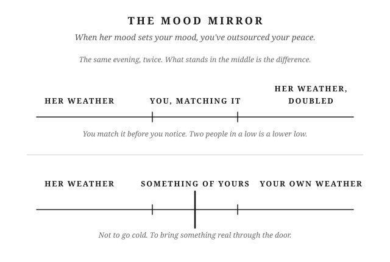</figure>

## Putting It Into Practice

1. Before walking through the door, take thirty seconds to check your own state: name it, don't borrow hers yet.
2. When you notice your mood shifting to match hers, ask: "Is this mine, or did I just pick it up?"
3. Practice bringing one steady thing into the room each day, a question, a small act, a calm tone, regardless of what mood is already there.

# Chapter 3: The Discipline of Not Reacting

There's a move you make when someone criticizes you. You didn't choose it. You learned it.

She says something. Maybe it's about your tone, or something you forgot, or a pattern she's noticed three times this week. Before you've really heard it, you're already building the response. Not because you're angry. Just because that's what you do. You're setting the record straight. Making sure she understands the context. Why it happened the way it did. Why it isn't quite as bad as it sounds.

You think you're being honest.

She thinks it's not worth bringing things to you.

---

**The Four D's.**

There are four versions of this. You probably run at least two of them.

**Defense.** She says you've been distant lately. You immediately bring up how much you've been working, how much she's been on her phone, how this is a two-way street. The intent is to show her the full picture. What it does is move the conversation into a courtroom. Now both of you are on trial.

**Deny.** She says you've seemed irritable. You say no, you haven't. This feels honest, because you genuinely believe you weren't. But in a marriage, most things aren't empirical. "You were irritable" isn't a fact she can prove. It's an experience she had. What you haven't learned to say is: *I hear that you experienced it that way, and that wasn't my intention.* Instead, you treat her report as a claim to disprove. What you've done is told her that her experience of the house isn't real. That's a strange thing to teach someone you love.

**Downplay.** She says the house is a mess. You say it's not that bad. Now the argument isn't about the house. It's about the degree of messiness. That debate has no resolution. The original concern is buried.

**Deflect.** She raises something about your behavior. You say: why are you so focused on me? You've moved responsibility from yourself to a target. She came in with a concern and left with a redirect.

In moderation, and at the right moment, each has a place. Denying something you genuinely didn't do is reasonable. Asking for consistent treatment is reasonable. Noting that the delivery is out of proportion to the issue is reasonable. Defending yourself against an attack is reasonable.

The problem isn't the response. It's the pattern. When any of these becomes the automatic first move, it fires before she's finished. It doesn't matter what she's actually bringing. It overrides what would make the conversation useful: curiosity, understanding, the capacity to hear. And all four share one common cost: they tell her that what she brought to you isn't being received.

All four feel like honesty. None of them are listening.

---

**The cost.**

She picked the time, chose to say it, and came to you with it. When she got the defensive response back, she registered it. Not consciously, not dramatically. She just updated her model of what it costs to bring things to you.

She does this enough times, and she stops.

Not the easy things. The easy things still come. What stops is the harder stuff. The things she's been sitting with. The things that actually matter.

You notice she seems a little distant. Nothing happened. She's fine. Just quieter than she used to be.

John Gottman spent decades in a research lab watching couples argue. His team could predict which marriages would survive, just from watching how two people fight. They did it with above 90 percent accuracy, from samples as short as three minutes. His work puts defensiveness alongside contempt, stonewalling, and criticism as the behaviors most likely to end a marriage. Not because any one episode is catastrophic. Because the pattern, repeated over years, teaches a partner that this isn't a safe place to be honest. It doesn't end with a fight. It ends with her stopping.

---

**The practice.**

Seneca had a practice he called *praemeditatio malorum*. Pre-living the hard thing. The logic: what you have already considered cannot catch you unprepared.

He wrote that "it is the unexpected that puts the heaviest load upon us," and a few lines later he gave the remedy: "Our minds should be sent forward in advance to meet all problems, and we should consider, not what is wont to happen, but what can happen." (*Epistulae Morales*, Letter 91, trans. Gummere)

You can feel when something is simmering between you. Not a fight. Just a weight in the air. Two days quieter than usual. You know it needs a conversation. But not tonight. Not when you're both tired. Not when the moment isn't right.

The Stoic move isn't to push through anyway. And it isn't to ignore it and hope it resolves. It's to make a deliberate choice: *I'm going to come back to this when we're both calmer.* Then use the time between now and then.

Most men don't. They wait, dreading it, without doing anything with that dread.

You use that window. You pre-live how the conversation might go. You feel the pull of the Four D's in your imagination, before it's real. You decide in advance what you'll do when you feel that pull. So when the moment comes, you're not caught off guard, driven back to the automatic pattern. You already made your choice.

---

**People are rational.**

You've thought it. Maybe just once, maybe more: she's being irrational. The frustration doesn't match the situation. The intensity seems like too much.

She isn't.

Marcus Aurelius kept returning to this in *Meditations*. He wrote it in Book 11, about the people who do you wrong: *"it is plain that they do so involuntarily and in ignorance. For as every soul is unwillingly deprived of the truth, so also is it unwillingly deprived of the power of behaving to each man according to his deserts."* (*Meditations* 11.18, Long trans.)

The people who frustrate you are not choosing irrationality. They're doing what makes sense from where they stand. Their history, their read of what's been building, their pattern of what they've observed. From their angle, it makes sense.

Your wife is not irrational. She's working from a different set of observations than you. In some cases, a more accurate set. She has the outside view of your behavior. You don't.

When you hold that frame, there is nothing to defend against. There is something to understand. That's what makes listening feel like intelligence rather than surrender.

---

**The record.**

Some men hear this and overcorrect. They stop defending, but they also stop being honest. They agree with everything in the moment, never correct the record, and the resentment builds underground. That's not the answer either.

You have a perspective, and you're allowed to have one. The question is when and how you state it. Not in the heat of the moment, while she's upset and you're fighting your own pull toward the Four D's. That's the wrong time, and it always goes badly. Later works better: when things are calm, and the goal is to leave the conversation in a better place.

You say what you actually think: what didn't sit right, what you believe is true about the marriage. You say it plainly, without performance, without needing her to validate it. This is the fourth virtue from Chapter 1: brave enough to stay engaged. Not brave enough to win the argument. Brave enough to say the real thing and leave it there.

You don't need her to agree in the moment. Things said take time to sink in, and most have to be said more than once before they land. Her response in the next ten minutes isn't the measure. You said what was true, and that's enough. When you've learned this difference, you're someone she can actually come to. Not because you always agree. Because she knows the door is open. That's what she was looking for when she brought it to you in the first place.

---

The Four D's are automatic. Absorbed before you had words for them, installed by watching. You didn't design them. But you don't have to run them.

What interrupts the automatic isn't willpower in the moment. It's preparation before it. You saw the conversation coming. You used the window. You already decided.

When she brings something to you tonight, the door is either open or it isn't. She can tell. She's been keeping track longer than you know.

---

<figure class="plate">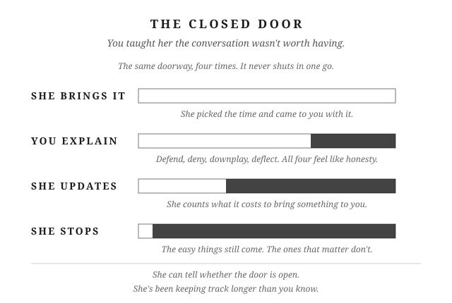</figure>

## Putting It Into Practice

1. Before a conversation you're dreading, spend five minutes pre-living it: what will she say, what's your instinct, what's the alternative response.
2. Catch yourself mid-Defend, Deny, Downplay, or Deflect. Name which one it was, out loud or in your head, the moment it happens.
3. Once a week, ask her directly: "Is there anything you've held back from telling me because you weren't sure how I'd take it?" That's the door this chapter is about. Open it on purpose instead of waiting for her to try again.

# Chapter 4: Anger Is Failed Leadership

Anger works. That's the part nobody tells you when they're explaining why it's a problem.

The chemicals that fire when someone challenges you. The narrowing of thought that makes you fast and not very careful. That system exists because it worked. Every culture on earth has tried to explain anger and contain it. The Stoics wrote books on it. Researchers have spent decades measuring it. All that attention exists because anger is universal, not because it's rare.

It showed up in your life this week. Maybe not as a flare. Maybe just the quiet version: the shortened answer, the silence that had something behind it, the cold shoulder that lasted longer than you meant.

The question isn't whether you get angry. The question is what you do with it.

---

**Why it exists.**

Researchers have produced more than one theory for why anger evolved, and none of them call it a mistake.

The oldest and most intuitive: anger evolved to defend resources. Territory, food, mates, status. The man who moved quickly to protect what was his had an edge. The system is fast. It narrows your thinking to the immediate threat and generates the intensity needed to back up a claim. It exists because it worked.

A more recent theory goes further. In 2009, Aaron Sell and colleagues at UC Santa Barbara proposed what they call the recalibrational theory. The core finding: anger doesn't fire only when something is being taken from you. It fires when you detect that another person isn't weighing your welfare sufficiently. The signal it sends: "You are not accounting for me correctly." Your face changes, your voice changes, your body shifts. All of it tells someone else what you cost to disregard. (Sell, Tooby, and Cosmides, "Formidability and the Logic of Human Anger," *PNAS*, 2009.)

This explains a wider range of triggers than resource defense alone. When you get angry because you feel dismissed, disrespected, or ignored at home, you're not just protecting territory. You're running a deeply wired social signal: "You are not treating my interests as real." The signal is real. The mechanism is real. Whether the tool fits the situation is a different question.

---

**The resource frame.**

In a marriage, the finite things are real. Your time. Your energy. Your attention. Your standing inside the home. When you're depleted and another demand arrives, the scarcity is real. When you feel dismissed in front of your children, the cost is real.

Respect is the social contract that acknowledges those things belong to you. Not a feeling. An agreement: your needs count, your interests are worth accounting for. Every long-term relationship has that contract, stated or not. When it feels violated, the anger mechanism fires for the same reason it fires when any finite resource is threatened.

The mechanism is doing its job. That doesn't mean the job fits the situation.

---

**The forms.**

Anger doesn't always announce itself.

Sometimes it's hot: a raised voice, full volume, something said that can't be retrieved. Sometimes it's cold, and cold is often worse. Three days of silence. A hardness in the face that won't break. Withdrawal that punishes without ever naming what it's punishing for. Both are anger. Both make holes.

The triggers span the same range. On one end: disrespect in front of your children, a major decision made without you. On the other end, it's smaller. She watched the next episode without you. The house is a mess again. You came home depleted, wanted something acknowledged, and nothing came. Most men dismiss those as "not really anger." That's the error. The tone just shortened. You went quiet in a specific way she felt. The mechanism is the same.

Both partners can get angry. Both can escalate. This chapter addresses you because you're reading it. But when both of you are in the activation state at the same time, it can move to places neither of you chose. Recognizing it in yourself is where your work starts.

---

**The wrong direction.**

The system was built for external threats. A competitor. An actual violation. Something genuinely coming for what's yours.

When there are no external threats and the system activates anyway, the activation goes somewhere. In a marriage, it goes to the person closest. You reclassify her as the threat the system was designed to handle. Not consciously. Not deliberately. The mechanism doesn't check the relationship before it responds.

She isn't the threat.

When you turn off your logic and lash out, the system aims at the nearest target: her. Your body can't tell the difference between a rival tribe and the woman across the table. The system fires at the signal, not at the actual relationship.

Seneca's *De Ira*, his study of anger, described what happens at the moment of activation in three stages. The first is involuntary: "a preparation for passion, as it were, and a sort of menace." The flush, the narrowing, the physiological response that arrives before any choice. The second stage is a choice: whether you decide the response is justified. The third stage is when reason has already been overtaken. (*De Ira*, Book II, trans. Basore.)

The gap between the first stage and the second is where everything lives. That's where your *prohairesis* lives. The governing faculty. The part of you that chooses before you react. Chapter 1 named that gap. Three seconds. This is what those three seconds are for.

Marcus Aurelius wrote it plainly in *Meditations*: "to be moved by passion is not manly, but that mildness and gentleness, as they are more agreeable to human nature, so also are they more manly; and he who possesses these qualities possesses strength, nerves, and courage, and not the man who is subject to fits of passion and discontent." (*Meditations* 11.18, Long trans.) He wasn't describing an achievement. He was writing to himself, leading an army through a war he didn't choose, about what actual strength looks like.

Anger isn't strength. It's the absence of it.

---

**The holes.**

There's a parable, origin unknown and widely circulated, about a father who gives his son a box of nails and a hammer. Every time the boy loses his temper, he drives a nail into the fence post. Weeks of nails. Then, as the boy learns to govern himself, the father tells him to pull one nail for every day without an outburst. It takes longer to pull them out than it did to drive them in. Eventually the last nail comes out.

The father takes him to the fence.

It's full of holes.

"You've done well," the father says. "But look at this fence. It will never be the same. When you lose your temper, you drive a nail. When you pull the nail out, the hole is still there."

The boy thought he'd fixed it. The fence showed him he hadn't.

That's what most men miss. An apology pulls the nail. It doesn't fill the hole.

Think about a moment, not necessarily dramatic, where you raised your voice once under real pressure. It felt justified. By morning it was over, or close enough that life moved on.

But she noticed. She didn't say anything. A few months later, something had shifted. Not in what she brought to you. In how she looked at you. A slight adjustment in what she believed you were capable of. No single incident she could point to. Just an updated sense of who she was dealing with.

You didn't know which nail made which hole. You'd already pulled most of them.

The blur, the accumulated weight of incidents each addressed and moved past, becomes a feeling. Not a list. Just a quiet, settled belief: you can't be trusted with the hard stuff. That feeling, over time, becomes disdain. Disdain becomes contempt.

Contempt, Gottman found, is the single strongest predictor of divorce: the most reliable signal from all those years watching couples. Not the fights. The slow corrosion of a partner's sense that the other person is worth full effort anymore. You don't get there from one bad moment. You get there from hundreds of small ones that were never quite fully repaired.

---

You don't know which cigarette gave someone the diagnosis. Nobody does. The learning isn't forensic. You don't go back and find the specific one. You understand what the behavior leads to, and you stop.

Stop making holes.

What's already in the fence is Chapter 16's work. This chapter's job is simpler: name the gap. Know what it's for.

You feel the activation. The spike, the narrowing, the pull. You're not pretending it isn't happening. Seneca knew the first motion can't be stopped. You're not trying to stop it.

You're trying to govern what happens next.

That's what leadership looks like from the inside.

---

<figure class="plate">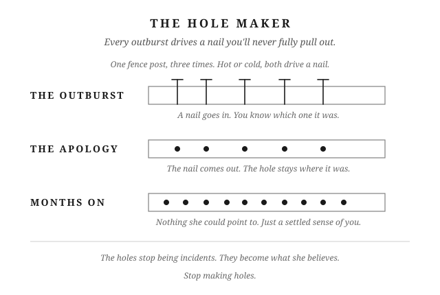</figure>

## Putting It Into Practice

1. When anger surges, name the gap: "First stage: involuntary. Second stage: my choice." Pause there before deciding.
2. After an outburst, instead of just apologizing, name the hole specifically: what did this cost, and what will you do differently next time.
3. Track your outbursts for a week, not to judge yourself, but to find the pattern: time of day, trigger, what was really going on underneath.

# Chapter 5: How to Fight Without Becoming Small

Part I has been about the gap. The three seconds between what happens and what you do. This chapter is about what happens when you're already inside a real fight, where everything you've built gets used at once and the only question left is what kind of man you are at the end of it.

---

**The arc.**

She's low, or you are. The temperature in the room shifts before the first word gets said. You feel it the way you feel weather. Then something gets said. Maybe it's small. Maybe it touches something already tender. The gap opens.

If you're not governing it, the Four D's are already running before you've decided to run them. You go on the defense. You deny what she's said. You downplay: *I did pretty well there, why are you making this bigger than it needs to be?* Then you deflect, pointing out something she hasn't done. Her original concern gets buried under a counter-prosecution. Neither of you wins. Both of you are slightly smaller than when you started.

That is the arc. You've run it before. So has she.

This is the last chapter of Part I because it's where all five chapters apply at once. The mood that infected your inner weather before anything happened. The gap that opened when the trigger hit. The Four D's that fired automatically. The anger underneath all of it. Now: what you do with the rest.

---

**The trigger with the nail in it.**

The Four D's don't fire hardest for generic criticism. They fire hardest for the ones that hit something already there.

Think about the word she uses that lands harder than its content warrants. The one that touches something you've been carrying quietly. You're not objectively what she said. You know that. But the accusation lands on something specific: a place where you don't feel seen for what you actually do, where the judgment feels like it's missing the full picture. That's why it hits.

You know this in your body before you know it in your head. Defense. Deny. Downplay. Deflect. Her original complaint gets prosecuted from the other direction. Now you're both defending. The thing that needed to be said is gone.

An apology will end the fight. The nail will stay in.

The reaction out of proportion to the incident is always telling you where the wound is. Not what she did wrong. What's already tender in you. That's worth sitting with.

---

**Becoming small.**

The Four D's are one version. There are others.

The withdrawal that punishes without naming itself. You go quiet in a specific way she can feel. Not because you're cooling down, but because you want her to know. Two days of distance between you that neither of you names. The sulk has no stated charge. She has to navigate it alone.

The winning of the argument while losing the relationship. You're right. She's wrong. The point is scored. The marriage is slightly colder.

None of this was decided. It was absorbed, the same way the rest of the blueprint was. The question the chapter title asks: are you leaving the fight the same size you were when it started?

---

**The view from above.**

Most fights are small.

Marcus put a name on the practice: the view from above. *"Look down from above on the countless herds of men and their countless solemnities, and the infinitely varied voyagings in storms and calms, and the differences among those who are born, who live together, and die."* (*Meditations* 9.30, Long trans.)

The same movement in a fight: zoom out until the thing is at its actual scale. You are fighting about what time to get up in the morning, not world peace. You are fighting about a messy room, a tone of voice, something that didn't get done. From altitude, most of what feels urgent in the moment becomes almost nothing.

The couples who stay married for fifty years didn't avoid fighting. They learned, over thousands of small fights, that most of them didn't need a verdict. The fight about the dishes. The cold drive home. The two-day silence after something someone said on a Thursday. You can't remember most of it. It didn't need to be resolved. It needed grace and a little time.

That's one outcome. You let it go. The decision is genuine, not a suppression: it belongs in the category of things that don't require a ruling. Let it be small. It is small.

But some things won't shrink from altitude. When you zoom out and the thing is still big, that's the signal. Four places a fight ends up: you let it go; you fight hard, both take damage, and then time passes and you call it resolved without the real conversation; you fight hard, both take damage, and someone has the courage to come back; or you communicate, either in the moment or after you've cooled. Most couples never return to it later. That's where the nails accumulate.

---

**The courage to come back.**

The Stoics called it *parrhesia*: frank speech. Seneca's version of it, from a letter to his friend Lucilius: *"I prefer that my letters should be just what my conversation would be if you and I were sitting in one another's company or taking walks together,—spontaneous and easy; for my letters have nothing strained or artificial about them."* (*Epistulae Morales*, Letter 75, Gummere trans.) He was writing about letters. The principle is the same in a fight. Not arranged for effect. The true thing, said directly, without managing what comes back.

When the Stoic husband comes back to the unresolved conversation, he waits until things are calm. He asks if they can talk. He says what is true for him, not as a prosecution, but because he doesn't want to be the man who stores things instead of saying them. Because the environment two people create when nothing ever gets addressed leaks into everything else in the house. The kids feel it too.

He says the true thing. Then he lets it land however it lands.

Her response is hers. Whether she hears it the way he meant it, whether it produces the conversation he hoped for: all of that is a preferred indifferent. He doesn't govern her response. He governs his engagement.

Not everything resolves logically. She may tell you this directly, and she'll be right. The Stoic husband has a framework built on reason. Marriage doesn't operate purely in reason. She lives in a register he doesn't always have full access to. Some misalignments won't resolve cleanly. Some conversations will need to be had more than once.

The courage to communicate includes the courage to leave something unresolved and come back to it again. Not because you need the win. Because you're committed to the conversation regardless of how long it takes.

---

Part I asked whether you can keep flowing when the rocks hit. Part II asks whether you can carry the weight over time. Steadily, without resentment, without disappearing. Everything you've built here is what makes it possible.

---

<figure class="plate">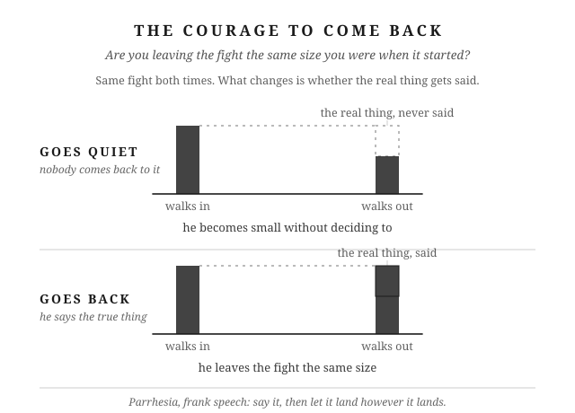</figure>

## Putting It Into Practice

1. Set a standing weekly check-in: fifteen minutes, no agenda but "is there anything sitting between us," so small tension gets a scheduled outlet instead of waiting to become a fight or a permanent silence.
2. Pick one unresolved issue and go back to it: say what's true, plainly, without managing how she reacts.
3. After speaking honestly, practice releasing the outcome. Her response is information, not a verdict on whether you did the right thing.

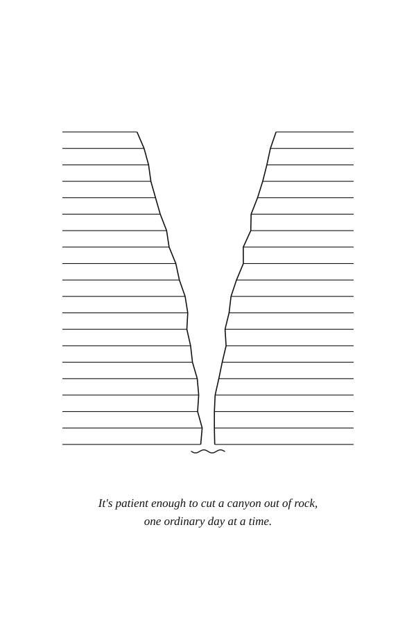

# PART II — THE STURDY OAK

*The oak is sturdy. Weight gets put on it and the branch holds. It stands where it stands, and it will be there tomorrow. It loses branches and doesn't stop being the tree. It gives shade in the heat and cover in the rain, and asks nothing for it. The storm comes through, and in the morning the oak is still there.*

# Chapter 6: Duty Without Resentment

You take out the trash every Tuesday night. You've done it for years. Nobody thanks you for it, and you don't expect them to. It's just your job, the way folding the towels a certain way is your wife's job, or driving the kids to practice is yours. Most of what holds a marriage together runs on this kind of quiet, unthanked work. So why does one offhand comment, on an ordinary night, undo three years of doing it without complaint?

---

**The split.**

Every household splits its work. Sometimes you sit down and divide it on purpose. Most of the time it just happens, one Tuesday at a time, until the dog walks belong to you and the dishes belong to her and nobody remembers deciding any of it.

Here's the part nobody warns you about: once the split happens, you mostly stop seeing her half of it. Not because you don't care. Because you're the one living your half. You feel every trip to the dump, every late night with the dishes, every weekend project nobody else watched you start or finish. You don't feel her half nearly as much, because you weren't standing in it. She's the hero of her own story the same way you're the hero of yours. The work she sees clearly is her own.

Some of what you carry has a name and a schedule. Trash on Tuesday. Dishes most nights. But a lot of it doesn't have either. It's a bucket. One weekend it's the ceiling fan that's been rattling for a month. Another weekend it's helping her finish a project she's been planning for weeks. Another it's gassing up both cars and running them through the wash, or coaching the flag football team because nobody else would. None of those jobs repeats often enough to earn a name, so it just lives in the bucket labeled "whatever needs doing." That bucket is exactly why this blindness gets worse the longer a marriage runs. There's no slot on the calendar that says "ceiling fan." There's no moment where either of you notices it got emptied again.

This isn't a flaw in your marriage. It's just how two people work. The philosopher Musonius Rufus called marriage a "community of life." He's a Stoic teacher most men have never heard of, even if they know Marcus Aurelius or Seneca. His idea was simple: two people running one shared project, not two private ones. That's the goal: one household, not two ledgers each of you keeps to yourself. But goals don't erase how human attention actually works. You still only live inside one half of the house.

---

**The paradox.**

But there's a catch. You don't need her to thank you for the trash. That's the whole point of doing it without resentment: it's your job, not a favor you're owed credit for.

The absence of thanks isn't neutral, though. It just sits there, quiet, until the day it isn't quiet anymore. When nobody's saying thank you, the only thing left to fill that silence is criticism. You don't need gratitude to do your job well. You do need something other than constant correction, or the job starts to feel less like duty and more like being used.

And when that correction comes, it rarely comes from malice. It comes from someone just as blind to your half of the work as you are to hers. She's not building a case against you. She's tired. She's overloaded. The only thing in front of her right now is a sink full of dishes and a husband who isn't in it. Overload looks for an outlet. Tonight, you're standing closest to it.

---

**The visible moment.**

Resentment almost never fires on the real math. It fires on what's visible right now, in the room, tonight.

Say you like to unwind at night. TV on, feet up, day done. She likes to fold laundry in the evening, basket on the couch, towels into stacks. Most nights that's just two people doing two different things in the same room. But some nights she'll say it: "I'm working all the time, and you aren't." And for a second, every trash bag you've hauled and every weekend you spent emptying that bucket disappears. None of that is in this room right now. What's in this room is one person sitting and one person folding.

It isn't really about the laundry. The total weight either of you carries that week has almost nothing to do with what fires in that moment. It's the visible difference, her hands moving, yours still, that turns an ordinary Tuesday into a verdict.

---

**The four D's.**

When that verdict lands, you've got four ways to swing back, and you already know all four, because you've used them before you ever heard them named.

You can defend yourself: list everything you did this week, out loud, like a man reading a closing argument. You can deny it: "That's not true, I do plenty." You can downplay it: "It's not that bad, calm down." You can deflect it onto her: "You're not exactly perfect either." Each one feels justified the second you reach for it. Each one also turns a tired woman's comment about laundry into a trial over your character, and that's a fight nobody wins, because now you're both defending instead of either of you listening.

The moment you produce a defense, you've handed her a reason to produce one back. Nobody loses an argument like that without reaching for their own evidence. So now there are two ledgers in the room instead of one shared project, and ledgers don't reconcile. They just get longer, week after week, until neither of you can remember what actually started the fight. That's how one comment about laundry turns into a referendum on a parent-teacher conference from three months ago. You didn't invent scorekeeping by accident. You invented it the moment you decided your tally was worth reciting out loud.

The stronger play costs more in the moment and pays more later. Notice what she's actually doing. Say so. Then make the play instead of defending: "I see you're working. I appreciate it. You want to sit down, or should I help first?" That single sentence does what no defense ever could. It closes the gap instead of arguing about whose gap it is.

---

**The question.**

Some nights the sting still lingers, even after you've said the right thing. That's when the question is worth asking yourself honestly: am I actually being lazy right now, or are we just out of rhythm?

Marcus Aurelius asked himself a version of this every morning he didn't want to get out of bed. You weren't born to stay under the covers, he told himself. Everybody has to go about doing their job. He wasn't talking about ambition. He was talking about the plain fact that a man does his work the way a horse runs or a bee makes honey. Neither one needs applause for it.

If the honest answer is yes, you were avoiding your own job. That's not an attack to defend against. That's a gift, and you take it. If the answer is no, you weren't lazy. You were just out of step for one evening. Give her the same grace you'd want on a night when you're the one folding towels and she's the one with her feet up. Either way, the tally never gets read out loud.

That's the whole difference between a man who carries his half of the house and a man who's quietly billing for it. One of them is steady enough to be counted on without needing to be counted. Resentment comes from scorekeeping. Chapter 7 examines the ledger directly.

---

<figure class="plate">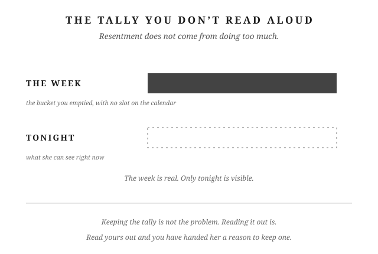</figure>

## Putting It Into Practice

1. Once a week, name one thing from her "bucket," the unscheduled stuff nobody put on a calendar, that you noticed but didn't have to do anything about. Say it out loud to her, or just to yourself.
2. The next time the difference is visible, one of you resting while the other works, say it before you defend: "I see you're working. I appreciate it. Want to sit down, or should I help first?"
3. When criticism stings and the feeling lingers, run the self-check before you respond: am I actually being lazy right now, or are we just out of rhythm?

# Chapter 7: The End of Scorekeeping

---

Somewhere inside you, there's a running total. You didn't sit down and decide to keep it. You just know where you stand.

---

**The fix.** The internet goes down on a Tuesday night, mid-show, and you're the one who gets up. You reset the router, check the cables, call the provider, wait on hold, get it working again. Nobody asks you to do this. It's just yours, like the ceiling fan that started clicking last month. Like the TV that needed a new setting after the last software update. You know your way around the house's machinery. So it falls to you, quietly, the way certain jobs always fall to the person who can do them. A few weeks before that, you spent an entire weekend at a tournament three hours away, coaching your kid's team. Managing snacks and rides and a hotel room. She stayed home and ran the rest of life without you. Both of those are real. Both of those took something out of you. And if anyone ever asked you to make the case for how much you give this marriage, those are the two stories you'd tell. They're the ones with a beginning, an end, and a name.

The dozens of smaller things neither of you tracks, on either side, wouldn't make your list. The question you didn't ask because you already knew the answer would start something. The five minutes spent finding her keys. Noticing she hadn't eaten and not saying anything about it, just handing her a plate. None of those would register if someone asked you to defend yourself. They're too small, too constant, too easy to forget you even did them. And that's exactly the problem this chapter is about.

---

**More than chores.** Marriages keep score on more than who did the dishes. Some couples tally whose income or whose caretaking counts as the real contribution. Some tally who sacrificed more: a birth, a career, a move. Some tally who's better at what, who's been hurt worse, who tries harder in the relationship. Different currencies, same instinct: somewhere inside you, a running total exists, and you didn't sit down and decide to keep it. You just know where you stand, the way you know your bank balance without checking it. This chapter goes deep on one version of that instinct, the oldest and most common one, the one about labor. Once you can see why it fails, you'll recognize the same failure wherever else you're running a private count.

---

**Two honest ledgers.** Picture a jar filled with rocks. A few big ones go in first: the visible contributions with a clear edge and a story attached. Fixing the router. The coaching weekend. The day you took off work for the family. Those are real, and they matter. But they don't fill the jar. What fills most of the space is sand: hundreds of small acts done without tracking them, poured in beneath and around and on top. They make up the majority of what's actually there. The big contributions are countable, memorable, citable in an argument. The small ones are everything else, and there's far more of them.

This is why the math never works when either of you tries to do it. You can list the things you did. She can list hers. Neither of you can list the countless small ones. They're made of things too small to register while you're doing them, for either of you, including the person doing them. Any tally you keep is built entirely out of the visible things, the smallest fraction of what's actually happening, and mistaken for the whole.

My grandfather had a piece of marriage advice he gave me once, and I've never forgotten it: give 60 percent, expect 40 percent. Not 50-50. Sixty-forty. He wasn't doing arithmetic. He was naming the only posture that survives a total neither of you can fully see. If you're only willing to give what you expect back in equal measure, you'll spend your marriage chasing a balance. That balance was never visible to begin with. You can only count what you remember, and what you remember was never the whole picture.

There's a researcher named Karl Pillemer who spent years interviewing people who'd been married more than four decades, asking what actually worked. Almost none of them talked about splitting things evenly. The phrase that kept coming up instead was some version of "give more than you get." That's not folklore. It's the pattern that shows up when long marriages describe themselves looking backward. A separate, much larger study, thirteen years of data on more than 7,000 couples, found something that points in the same direction. People who kept close track of what they were owed, expecting their giving to be matched back, saw their satisfaction erode over time. Most couples loosen that expectation naturally as the relationship deepens. The ones who don't tend to drift.

To be fair, none of that means the imbalance you feel is imaginary. Sometimes one person really is carrying more, and that's worth naming. What it does mean is that the running tally in your head isn't a reliable way to find out whether that's true. It can only show you the smallest, most visible slice of the work, and it will tell you that you're ahead. Your own invisible contributions are just as invisible to you as hers are to her. Figuring out whether an imbalance is real takes a different kind of looking: an honest, deliberate accounting rather than a private one. That's the next chapter's work. This one is about why the private tally can't do it.

---

**Whose column is this.** The Stoics built their whole philosophy on one sorting question: is this mine to control, or isn't it? Her effort isn't yours to control. Her noticing isn't yours to control. What you give, and how you give it: that's the only column with your name on it.

That's not resignation. It doesn't mean you can't name an unfairness or ask for something different. It means the private tally was never the right tool for finding a real imbalance. A tally that can only read your own side, built from contributions you happened to notice and remember, will tell you you're ahead every time. It's not evidence. It's arithmetic done on one page of a two-page ledger.

You can ask for what you need. You can have the conversation about what's unfair. But the private count of who's ahead was never yours to settle alone, because it was never just your column to keep.

Seneca wrote at length in *De Beneficiis*, his work on the philosophy of giving and receiving. Why does the recipient always underestimate what they've been given? His argument: you can never fully see everything that went into what someone gave you. Flip that around: when you receive what she gives, you're seeing the finished thing and missing everything that produced it. Gratitude for more than you can see is the only honest response to a ledger you can't fully read.

Marcus Aurelius put it plainly: when you've done something good, why look for credit beyond the act, or wait to see what comes back? There's the doing, and there's the need it met. That's the whole list. Don't reach for the third thing.

---

**The reconstruction.** Try this sometime when you're turning over a feeling of unfairness, the kind that shows up quietly, days later, while you're driving or half-listening to something else. Instead of running your own tally again, try running hers. Not the dramatic version. Go small. What did she carry today that you didn't see her carry? What did she notice so you didn't have to? What question did she not ask, the same way you didn't ask yours?

You'll find you can't finish the list. That's not a failure of memory. It's the same invisible weight, her side of it, just as hard to count as yours is. The point isn't to win at reconstructing her side better than she could win at reconstructing yours. The point is to feel, for a minute, how much of what she gives was never going to make it onto anyone's list, including her own.

Give 60 percent, expect 40: not because the math is fair, but because no math was ever going to find the bottom of that jar.

---

<figure class="plate">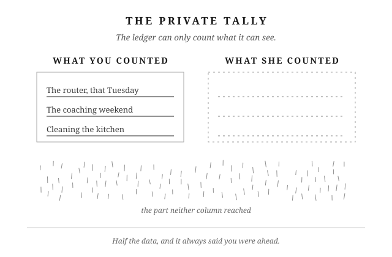</figure>

## Putting It Into Practice

1. When a feeling of unfairness surfaces, try running her tally instead of yours: go small. What did she carry today that you didn't see her carry?
2. Notice which currency you're actually tallying: whose income or caretaking counts as the real contribution, who sacrificed more (a birth, a career, a move), or who tries harder. Then ask honestly whether your count has ever included what she'd list, not just what you would.
3. This week, aim to give at a level where you're not tracking what comes back. Notice what changes when you loosen the expectation.

# Chapter 8: When Your Marriage Feels Unfair

---

The last chapter took the private tally apart. This one is about what the tally could never read, the part underneath it. And what to do once you feel it break the surface.

---

**Not one moment.** What lands on you as "this is unfair" almost never arrives as one clean grievance. It's built out of many smaller things you didn't count at the time because each one was too small to name. A critique that stung a little more than she meant it to. A weekend of work she didn't seem to notice. A morning where you swallowed something to keep the peace. Individually, each one is nothing. Together, over weeks, they add weight to an invisible scale. One day something small tips it, and the feeling that arrives seems to come from nowhere.

That's the first thing to see clearly. What feels sudden almost never is. You just notice it late. The small stuff underneath has been landing for a long time before it ever reaches the surface.

---

**Different shapes.** The shape of what's underneath varies from marriage to marriage, more than most books admit. You might be in the traditional configuration: not the earner, or earning less, doing more of the visible home tasks. That work goes uncredited because she's measuring by a different standard than you are.

Or it looks the opposite for you. You hold the primary income, or the harder job, and what you contribute goes invisible because it happens offstage. Its output, a mortgage payment, insurance, retirement money that doesn't exist yet, doesn't visually compete with a clean kitchen.

Or you're both working. You do more of the physical household work. She owns a whole different domain that's just as demanding but unseen: the kids' schooling, their activities, the medical appointments. You don't carry that channel's mental load. She does. That third shape isn't clean at all for you. It's task volume and recognition tangled together at once.

You know which shape yours is. What matters is that the mechanism is the same in all three. Many small things you didn't count at the time, and no one else counting them either.

---

**When it lands on you.** Sooner or later she'll name one. She'll say the thing she's been carrying. You'll feel the shape of an accusation, and everything in you will want to defend or counter. Before you do either, run one question at the moment before you speak.

Marcus Aurelius has a passage in *Meditations*, Book 5, section 28. Most men read it for a different reason, but it's the right tool here. He's writing to himself about how to think about a person whose fault is a small physical offense: "Art thou angry with him whose armpits stink? Art thou angry with him whose mouth smells foul? What good will this anger do thee? He has such a mouth, he has such armpits: it is necessary that such an emanation must come from such things." The point isn't the smell. The point is that anger is the wrong response to a fact. The honest thing to do is check whether the fact is actually real.

So when she names an unfairness, the diagnostic is a question you speak to yourself first. Is what she's saying true, or not true?

Say it's true, even partly, even in a shape you didn't see until she said it out loud. If so, the work in front of you is not an apology performance. It's a construction project: real change, in the thing you actually fix, over time she can watch you fix it. An apology by itself won't answer what she's actually named. Different behavior will.

Or say it isn't true. She might be missing something she hasn't yet looked at, seeing only her side because that's the side she can see. She's very likely not being cruel. She's being unreflective, the same way you have been unreflective about her side a hundred times over. That calls for a quieter response than counterattack, and a slower one than a competing list. A plain sentence, said without heat: this is what I don't think you're seeing. Marcus's rule holds either way. Anger at what emanates from another person's blind spot is a waste. The correction, if it comes, comes without heat.

---

**When it's yours.** The harder direction is when the felt unfairness is your own. You've done real work. It met real needs. Nobody in the house seems to have noticed. You feel the pull to say something, or worse, to say nothing while quietly running a count.

Before either belief does its work, take the pause you already know how to take. The moment goes back to Chapter 1: three seconds, then the question. Am I being the best husband I can be right now, uncredited or not? The pause doesn't make the feeling disappear. It just keeps it from turning into a pointed comment, a flat tone, a door closed a little harder than it needed to be, before you've had the chance to answer what's actually underneath it.

Once you've taken the pause, you already have the belief-level tool for what's underneath. You had it last chapter. Marcus Aurelius, closing Chapter 7, told you not to reach for a third thing beyond the doing and the need it met. No credit, no return, no ledger entry. That was one Stoic naming the mechanism from one angle. What follows is another, making the same case from a different angle, so you carry the argument in stereo.

Seneca spends Letter 81 of his Letters to Lucilius on this exact question, on benefits and what the giver is actually owed. His answer: "The reward for all the virtues lies in the virtues themselves… the wages of a good deed is to have done it." That's the whole transaction. You did the thing. It met a need. It landed. The payment already cleared, at the moment of the doing. Her active gratitude for it belongs to a separate transaction. Wanting her to see it is human. Requiring her to see it, so your own sense of yourself can settle, hands her a lever nobody should be holding on your behalf.

Two philosophers, one point, coming at you from two directions on purpose: the finished good deed doesn't need a receipt.

---

**Gratitude, standing.** There's an asymmetry inside a marriage worth naming here. Grievance is contagious. The moment one of you names a felt injustice, the other opens a competing ledger. Who's more tired. Who's given up more. Who's been let down worse. Neither of you can hear the other, because you're each defending a different account. Gratitude has never once done that. Nobody has ever answered a partner's grievance with a competing round of thanks, racing to prove they're more served, more fortunate. The one-way traffic tells you which of the two is safe to keep in the house.

Which brings the last chapter's closing arithmetic back around. Give sixty, expect forty. Not because the math is fair, but because expecting less means you aren't the one keeping a quiet count in the first place. Genuinely grateful for what your wife carries, most of which you cannot see, you're not the man who wakes up feeling shortchanged.

One more kind of unfairness runs underneath all of this. It isn't about labor or money or recognition. It's about temperament, how much of the emotional room in the house one of you takes up at any given moment. The next chapter takes that one on.

Keep gratitude standing in the doorway, and nothing quiet ever gets the chance to build a case against her.

---

<figure class="plate">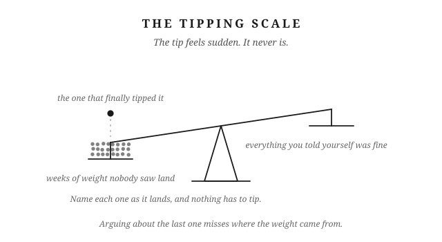</figure>

## Putting It Into Practice

1. When something stings, name it to yourself right then. An irritation you've named loses its power to quietly compound.
2. On a regular rhythm, monthly, or whenever a season changes, name explicitly whether the current imbalance is temporary (a hard stretch that will pass) or structural (the new normal). Don't wait for resentment to force the question.
3. When you've done something real and nobody's noticed, remind yourself the work already paid itself the moment it was finished. You don't need her gratitude to know it counted.

# Chapter 9: Silence Is Not Peace

You know the line. Happy wife, happy life. Said with a grin, like a joke between men who've made their peace with it. You've lived by it more literally than you'd ever say out loud. Every "sounds good." Every "whatever you want." Every small opinion you swallowed because raising it felt like more trouble than it was worth. That's not peace. That's a bill you're paying in quiet installments, so quiet you've stopped noticing them.

---

**The line.**

On the surface, the line is fine. You want her happy. You'd rather bend than fight. Most of what she asks isn't worth a stand. And the men who hand you the line mean well by it. They're trying to give you a shortcut through the friction of two people sharing a life.

The trouble is what the line is actually doing underneath. You comply, and you stay quiet, and somewhere in you, without ever saying so, you expect something back for it. Respect. Warmth. To be wanted. To be listened to the way you listen. You never named the deal out loud, so she never agreed to it. She doesn't even know there is one.

Isn't being agreeable just love, though? Sometimes. A yes you actually meant is love. A yes you gave expecting something back for it, something you never asked for directly, is a deal. Two psychologists, Dana Jack and Diana Dill, gave the habit underneath it a name in 1992: self-silencing. It means hiding what you actually think and want so things stay smooth on the surface. Their original research was done on women. The pattern isn't about gender. It works the same way in men.

Robert Glover names a version of this in *No More Mr. Nice Guy*. The man who never says no isn't being loving. He's performing, running a deal he never wrote down. He accommodates. In return he expects appreciation, closeness, sex, being seen as easy to live with. He never once said that's what he wanted. His wife can feel that something is expected of her. She just can't always name what.

Chapters 6 and 7 already talked about the mental tally you keep of who does more around the house. This is the same habit, aimed somewhere else. Instead of tracking chores, you're tracking what you think you're owed for staying quiet. Nobody sees that list but you.

---

**The list.**

This isn't usually one blowup. It's smaller than that, and it happens more often. Every night you did everything she wanted and it still turned into a sexless night. Every time you went along with what she wanted to do, and she didn't want to do what you wanted. Every story of hers you listened to all the way through, and she never asked to hear one of yours back.

None of those is a fight. None of those even sounds like a complaint you'd bring to her. But you remember them. You're keeping a list. The same kind of list Chapters 6 and 7 already described. Every unreciprocated night adds one more line to it.

There's an old word for this. Gunnysacking. You keep every one of these small disappointments quietly out of sight. You don't name them one at a time, while they're still small and manageable. John Gottman spent decades studying what actually predicts divorce, and he found four warning signs: criticism, defensiveness, contempt, and stonewalling. Contempt is the one that matters most here. It's what disappointment turns into when it never gets spoken and never gets addressed. It happens slowly instead. Disappointment curdles into resentment, then into something closer to disdain, aimed at the person you're not telling any of this to.

---

**Why you don't say it.**

It's not that you're afraid of disappointing her. You're not running a calculation about her feelings at all. You're exhausted. Work, money, everything else life is currently demanding, and the marriage is the one place that still feels stable. Saying something real risks that stability. So you don't say it. It doesn't feel like avoidance in the moment. It feels responsible.

Marcus Aurelius named the same instinct, in a different context. He was an emperor who wrote a private notebook to himself that later became the *Meditations*. "I have often wondered how it is that every man loves himself more than all the rest of men, but yet sets less value on his own opinion of himself than on the opinion of others. If then a god or a wise teacher should present himself to a man and bid him to think of nothing and to design nothing which he would not express as soon as he conceived it, he could not endure it even for a single day." (*Meditations* 12.4, Long trans.) Read that as a diagnosis. It explains something true about you. Many men are built this way. You protect whatever peace is left, even at the cost of never saying what you actually think.

The trade doesn't actually protect peace, though. It costs it. The writer Elie Wiesel once said the opposite of love isn't hate. It's indifference. Caring too little to risk the fight. Apply that at home, and staying quiet to protect the peace isn't you choosing love over conflict. You're choosing to care a little less, one night at a time, because caring less feels safer than risking what's left. You'd rather be quietly unhappy than actively unhappy. That trade doesn't feel like giving up. It feels like keeping the peace. But quiet unhappiness, kept up long enough, is just apathy with better manners.

---

**What restraint actually means.**

Now for the misreading a thoughtful man will make here. Epictetus, in his handbook the *Enchiridion*, tells his student to mostly keep silent. To speak rarely. And when he does speak, not to blame or praise or compare other people. A Stoic-curious reader picks that up and hears: Stoicism means staying quiet. Perfect. Confirms the strategy.

But that's not the whole point Epictetus was making. He wasn't telling people to go silent forever. He was telling them to be picky. Save your words for what actually matters instead of wasting them on gossip and trivia. That's a rule about how much you talk. It has nothing to do with hiding things from your wife.

So run the same four questions Chapter 1 already gave you. Is this actually worth saying, and is now the moment. Are you willing to say it even though it risks the peace you've been protecting. Can you tell the difference between what genuinely needs raising and what you should just let go of. This isn't permission to bring up every little annoyance. And when you do speak, can you deliver it as your position rather than an attack on hers.

The logical part is the check on whether it's real and now. The brave part is being willing to risk the stability to say it anyway. The self-controlled part is the discipline to name the small things before they pile up. It's also knowing when not to raise a fuss about nothing. The kind part is the delivery. That last one is what keeps this from turning into permission to complain. Restraint means choosing what's worth saying, and saying it well.

Chapter 8 already showed you what happens when the calmer person in a marriage never says what they think. The louder, more reactive person wins by default, every time. Staying calm was never supposed to mean staying silent.

---

Next time you're about to say "sounds good," check whether it actually is, and if it isn't, say so, plainly and kindly, while the sack is still light.

---

<figure class="plate">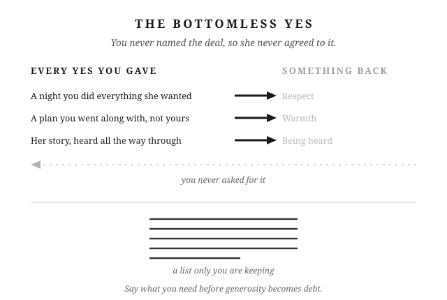</figure>

## Putting It Into Practice

1. When something disappoints you and you decide to let it go, name it to yourself anyway, so it doesn't just disappear into a pile you're not tracking.
2. Once a week, tell her one specific thing you actually wanted, even something small, before it has the chance to become part of a list she doesn't know exists.
3. Before raising something bigger, run the four-question check: is this worth saying now, are you willing to say it despite what it risks, is this actually worth raising versus letting go, and can you deliver it kindly?

# Chapter 10: Boundaries Are Strength

There are rules in your marriage nobody ever wrote down. You'd defend them
anyway. Ask what one of them is actually for and most men come up empty.

Epictetus spent his early life as a slave and the rest of it running a school.
His handbook, the *Enchiridion*, is a short field guide to living, and its
thirty-third section opens by telling you to settle that question early, before
anyone is watching.

*"Immediately prescribe some character and some form to yourself, which you
shall observe both when you are alone and when you meet with men."*

Take the old language off and it's this. Decide what kind of man you are
before you walk into the room. Then be that man, whether anyone's watching or
not.

You already know how this works. You decided what you'd eat before you got
hungry. You decided what time you'd get up before the alarm went off. So when
did you last do that about your marriage?

A boundary is a line you don't cross, and one you don't let anyone else cross
either. That's all it is. Not a mood, not a rule you invent when you're
annoyed. A line, decided ahead of time, that holds when somebody leans on it.

You have them already. You have boundaries on money. You have boundaries on
your kids. You have boundaries on your marriage. You have boundaries on
family. Most of them you've never said out loud, to your wife or to yourself.

Those lines are what the marriage is built on. Take them away and it doesn't
get warmer or easier. It just stops holding its shape.

And setting a boundary isn't unkind. Brené Brown, who studies how people
handle hard conversations, puts it as clear is kind, unclear is unkind. She
says she picked it up in a twelve-step meeting years before she ever wrote it
down. Being vague about where your lines are isn't generosity. It just makes
the other person guess.

**The test.**

First you need a way to tell a real line from a fake one.

A boundary protects something you can name. A preference is something you
want. That's the whole difference, and it decides whether the rule survives
the first person who pushes on it.

Take the money one. What is it protecting? Not what it stops. What it
protects. If the answer is that you don't like being surprised, that's a
preference. If the answer is the savings, or the house you're working toward,
or the two of you making big calls together, that's a boundary. Most men have
never answered that question out loud, and that's exactly why the rule folds
when somebody leans on it hard enough. There was nothing underneath it.

Run it on a second one. You don't let friends complain about your wife to you.
What is that protecting? It isn't your comfort. It's her standing with the
people around you, which is yours to look after whether she ever finds out you
did it or not. Now you can hold the line, because you know what you're holding
it for.

Naming it does something else, too, and this is the part most men never get
to. It changes the argument you have with your wife.

When the two of you disagree about a rule, you argue about the rule, and that
argument has nowhere to go. Nobody ever won "no screens after dinner." But if
you can both say what it's for, you're having a different conversation
entirely: is this actually what our kids need right now? She might think
you're wrong about the screens and agree with you completely about the kids.
That's two people working on the same problem. The other version is two people
defending positions.

So you don't need her to agree about the rule. You need the two of you aligned
on what you're protecting. Get that part right and the rule mostly sorts
itself out.

The test also keeps you from becoming a different kind of problem. A man who
holds firm on everything isn't strong. He never did the work of deciding what
was worth holding. So he treats every hill the same, and everyone around him
has learned to stop asking. What doesn't bend is the line. How you say it,
when you say it, how much grace you give the person leaning on you: all of
that can flex, and should.

Karl Pillemer interviewed seven hundred people who'd been married thirty years
or more about what puts the most strain on a marriage. In-laws, money, and the
way two people speak to each other all came up.

**What you do to each other.**

Start closest in, with the lines between the two of you.

Mine are simple, and I suspect yours would be too if you wrote them down. We
don't get physical. I don't call my wife names. Neither of us speaks poorly
about the other one to friends or family. That's the whole list.

The specific rules matter less than you'd think. Another couple's list would
look different and work fine. What matters is that the list holds, and holds
is a word that only means something under pressure.

What the list protects is the part of a marriage that doesn't repair. People
keep things. If you call your wife something ugly at eleven at night, she will
still have that sentence five years from now, long after you've both forgotten
what the fight was even about. If it ever gets physical, she keeps that for
good, and so does the marriage. Some things don't wash out. The list is there
so the worst night the two of you ever have still leaves a marriage standing
in the morning.

Three things will lean on it.

The first is anger. It's easy to keep a line on a Tuesday when nothing's
wrong. It's a different thing at eleven at night in the middle of something
that's gone sideways, when you've got the sentence loaded and you know exactly
where it would land. That sentence is available to you. It always is. Not
using it is the entire job.

The second is company. Somebody starts in about their wife, and there's a seat
open next to them, and it costs nothing to sit down. Think of your friend's
picture of your wife as a cup. Everything you say about her pours something
in. It doesn't drain back out. Months later he won't remember the complaint.
He'll still have the picture you gave him, and he'll be a little colder to her
than he would have been, and he won't know why. It runs both directions. He
doesn't get to fill your cup either. A friend telling you something hard and
true about your own marriage is a gift. A friend complaining about her to you
is a different thing, and you can feel the difference while it's happening.

The third one is the hardest, and most men have no answer for it. Sometimes
you hold the line and she doesn't. She's tired, or she's had a week you
wouldn't wish on anyone, and something comes out of her that's on the list.
Now what?

Epictetus answered that one a few sections earlier in the *Enchiridion*.

*"Is a certain man your father? In this are implied taking care of him,
submitting to him in all things, patiently receiving his reproaches, his
correction. But he is a bad father. Is your natural tie, then, to a good
father? No, but to a father."*

He's talking about a son and a hard parent, and the reasoning carries straight
over. What you owe comes from the relationship, not from the other person's
scorecard. You're not her husband on the condition that she has a good week.
That was never the deal, and if it were, it wouldn't be a boundary. It'd be a
trade.

A trade is void the moment the other side stops paying. A boundary isn't,
because it was never a payment. It's who you said you'd be.

You hold it anyway.

**What you do with money.**

Money is the clearest case, because the line is a number and the pressure
shows up on a specific day.

My wife and I have an amount above which neither of us spends without talking
first. It isn't permission. Neither of us is anybody's parent. Past a certain
size a decision belongs to both of us, and the conversation is the whole
point. When one of us crosses it, we talk about it. Not a fight. A
conversation, because something we agreed to didn't hold, and pretending we
didn't notice would cost more than the money did.

The harder version is family.

We have people close to us who need money, more than once, and years ago we
settled on a rule. You can borrow one time. Pay it back and the door stays
open, always, for whatever comes next. Don't pay it back and that was your one
time, no matter how bad the next ask gets. A surprising number haven't paid it
back. The rule holds anyway.

That doesn't feel like wisdom in the moment. It feels like being the guy who
said no to family. Two things lean hard here. The first is that the need in
front of you is usually real. Nobody asks for money because things are going
well. The second is that you and your wife are two capable adults who may see
this differently, and neither of you is being unreasonable.

Henry Cloud and John Townsend, two psychologists who wrote a book called
*Boundaries*, put words to why the rule isn't cruelty. People grow by meeting
the results of their own choices. When you keep stepping in and covering those
results, you haven't spared anyone anything. You've just paid it yourself. Do
that a few times and everyone learns who pays.

Say what it protects, because from the outside it looks like something it
isn't. You're not cruel. You're not heartless. You're not greedy. You have a
family to run and a short list of things you're trying to reach. Retirement.
College, maybe. A stretch of years where the two of you aren't lying awake
about money. None of that survives being the person everyone comes to when
they've run out of options. That's what the rule is for, and I can say it in
one sentence, which is how I know it's a boundary and not just a feeling about
money.

You hold it anyway.

**How you run your family.**

Then there's the shape of the life the two of you are building. Where the
holidays happen. What you do about religion, or politics, or the things you
were each raised to believe. Whether there's dinner at the table on a
weeknight. How the kids get raised, disciplined, and talked to. What they're
allowed to watch, because there are things a seven-year-old can't unsee. What
they're allowed to put in their bodies, and until what age, because you'd like
them to start from a decent place.

You and your wife get a say in that. Not everyone does.

Most of it was never written down. You didn't sit down and formally decide
that Sunday night is what it is in your house. It just became true, and it's
real, and it belongs to the two of you. Which is exactly why someone can walk
straight through it without knowing there was anything there.

That someone is usually a parent or a grandparent, and they're rarely being
malicious. They raised a family too. They have opinions with thirty years
behind them. They think they're helping, and sometimes they are.

You'll know the moment when it arrives. Say the two of you decided months ago
that Christmas morning happens at your house now, because you've got small
kids and you're done doing three stops before noon. Then it's October, and
your mother mentions, lightly, almost thinking out loud, that she just assumed
everyone would come to her like always. Nothing in that is a fight. She hasn't
asked you for anything. She's left an assumption on the table, and you can
pick it up or let it sit there and turn into December.

The line itself is simple: a decision the two of you already made together is
closed. The hard part isn't drawing it. It's who does the work of holding it.

Most men hand that job to their wife. You send her to talk to your own mother.
Or her father calls you about something already settled, and instead of
answering him, you carry it home and set it down in front of her. The line was
yours to hold and you gave her the uncomfortable half of it. Do that enough
times and she learns that when your family gets difficult, she's in it alone.

So you take the call. And what you say isn't a demand that they change,
because you can't make them, and trying is how this turns into a war nobody
wanted. Nedra Glover Tawwab, a therapist who writes about boundaries, teaches
a version that works: say what you need and what you'll do, not what the other
person has to become. In practice that's one sentence from you. When something
is already decided between us, bring it to both of us. If it keeps happening,
you stop taking that call alone. You never once told him what to think.

He still gets your patience. He still gets invited. He still gets to be a
grandfather, and he should. What this protects is the family you're actually
trying to build: a holiday your kids remember as calm instead of a day spent
in the back of a car, traditions that belong to your house, a childhood shaped
by the two of you rather than by whoever pushed hardest that year.

You hold it anyway.

---

**The part that costs you.**

Naming the line is the easy half.

Every boundary you set will eventually be tested by somebody who loves you, or
somebody you love, and it will not feel like a principled stand while it's
happening. It'll feel like being the bad guy in your own house.

Your kids will complain. Not once. Constantly, and on a Tuesday when you were
already finished at four. There's a version of that night where you give in,
and you'll tell yourself you're picking your battles. You're not. You just
traded the thing you were protecting for an hour of quiet. Almost every couple
makes that trade at some point, and it's usually why they end up arguing with
each other instead of with the kids. One of them wanted peace in the house
more than they wanted the thing they'd agreed to protect.

Your mother will be hurt about Christmas. Your father-in-law will decide
you've gotten rigid. The cousin you turned down will tell somebody you've
changed.

None of that means you got it wrong. It means you're the one holding it. That
job doesn't get handed to anyone else in your house, and doing it on the night
it costs something is the entire difference between a line you drew and a line
you keep.

You're not holding any of this to win, you're holding it because your marriage
is what's on the other side of it.

---

<figure class="plate">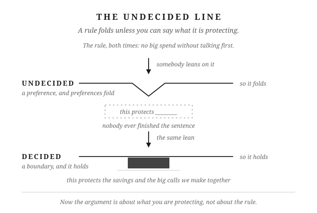</figure>

## Putting It Into Practice

1. Write down the three or four lines you and your wife actually hold, and next to each one finish this sentence in plain words: this protects ___. Any rule you can't finish is a preference, and it will fold under pressure.
2. When the two of you disagree about a rule, stop arguing about the rule. Ask what each of you thinks it's protecting, and have that argument instead.
3. The next time holding a line would make you the bad guy, notice the trade you're being offered: the thing you were protecting, in exchange for an hour of quiet.

# Chapter 11: Speak or Endure

You've decided not to bring it up, but you're still thinking about it. Maybe it's a purchase you wish you'd discussed first. Maybe it's a remark that embarrassed you in front of the kids. You let the evening go on. Now you're in bed, explaining to yourself why you stayed quiet.

You tell yourself you have to choose your hills to die on. Sometimes that's good judgment. A small annoyance doesn't need a long conversation. But sometimes you're avoiding a conversation because you expect it to be uncomfortable. You want her to know you're hurt without having to tell her.

From her side, you haven't said there's a problem.

---

**Decide what needs your attention.**

Before you decide to speak, ask what you're dealing with. Some problems need a conversation or a practical step. Some hardships can't be ended by either of you. Some annoyances aren't worth trying to change.

A purchase you couldn't afford may need a spending agreement. An illness may mean months of care, even when you're doing everything you can. A hobby you don't enjoy may simply be something your wife likes. Staying quiet about all three won't serve your marriage. Neither will trying to fix all three.

Start with the problem you can act on. Have you said what's bothering you? Have you made a clear request? Have you tried the practical step that might help? You can't know whether a conversation will help if you've only imagined having it.

You might have tried already. Perhaps you've asked for counseling and she won't go. That matters. An offer she's refused is different from an offer you haven't made. Be accurate about which position you're in. Her answer limits what you can do together today; it doesn't mean you have no choices left.

Other hardships won't end because you find better words. You can't talk a dying parent back to health. You can't make missing income appear by explaining how worried you are. You may still have bills to sort out, care to arrange, or help to ask for. But the illness or loss remains, and you have to live through it together.

Then there are preferences you can leave alone. You don't have to enjoy her hobby or choose all the same friends. If her brother's opinions annoy you, you can disagree without spending the whole visit arguing. Ask whether there's harm to address or just a difference you don't like.

Marcus Aurelius was a Roman emperor who wrote private reminders about how to live. One of them was about choosing what deserved his attention. *"It is in our power to have no opinion about a thing, and not to be disturbed in our soul; for things themselves have no natural power to form our judgments."* (*Meditations* 6.52, Long trans.) You don't have to decide what you think about every comment you hear, much less respond to it.

Some of my wife's friends aren't helpful to the relationship. They're not against it, but they say things that don't help. I tolerate that because I want her to have real friends. Those friendships matter more to me than the comments. Politics used to wait for Thanksgiving. Now it doesn't. I tolerate those conversations too.

Tolerance makes sense when you can say why you're choosing it. You want her to enjoy her friendships. You want to see your family even though you disagree about politics. You can dislike part of the visit and still want to go.

That doesn't make every problem a minor annoyance. If you're hurt each time a particular remark comes up, say what the remark does to you. Calling it small won't help if you spend the next two days resenting it. And if you can let a difference go, let it go without reminding her what you put up with. Arguing about a harmless preference can use up the evening while the problem you need to discuss goes unmentioned.

---

**Get through hardship without shutting down.**

For about ten years, we lived mostly on my wife's income while I was building a company with no guaranteed paycheck. Three kids. Both of us working full time. We didn't know when the money would get easier.

When a hard period lasts that long, you get used to doing less for yourself. You cancel plans. You put off rest. Sometimes that's necessary. But you can keep doing it after the need has passed, because you stopped asking what you could afford to resume.

Notice what you've given up and whether it still needs to stay on hold. If you're exhausted, say you're exhausted. If you need an evening to rest, ask for it. Your wife can't help you make a different plan if you keep telling her you're fine.

Marcus wrote about bearing hardship this way. *"Everything which happens either happens in such wise as thou art formed by nature to bear it, or as thou art not formed by nature to bear it. If, then, it happens to thee in such way as thou art formed by nature to bear it, do not complain, but bear it as thou art formed by nature to bear it."* (*Meditations* 10.3, Long trans.)

In plain English: when you have to live through something you can bear, meet it without repeatedly telling yourself how unfair it is. Complaining won't end the hardship. That still leaves room to say you're tired, ask for help, and tell your wife you're worried.

There are several ways to get this wrong. You can become so overwhelmed that you stop doing your share and leave her managing everything. You can shut down and barely speak, getting through each day without much interest in her or the kids. Or you can insist you're fine until you lose your temper over a small mistake.

Being quiet doesn't tell you which of those you're doing. Look at how you're treating your family. Are you listening when she talks? Can the kids ask you a question without getting snapped at? Can you admit you're having a bad day before everyone has to guess?

Staying steady means you keep taking part in family life while admitting that it's hard. You do the work you can do. You accept help with what you can't manage. You tell her what's worrying you without expecting her to remove every worry.

You can have a difficult evening without making the whole family responsible for it. If you speak sharply, apologize for speaking sharply. The financial pressure may explain why you're tired. It doesn't settle what you owe the person you snapped at.

The hardship may last. You can still have honest conversations, pay attention to your children, and make room for rest while it does.

---

**Talk about the rule you disagree with.**

Suppose your wife raises her voice at the kids. Later, when you raise yours, she tells you that you're frightening them. You feel there's one rule for her and another for you. But you're reluctant to say so because it could sound like a request for permission to yell.

There may be a real difference in how the children experience your voices. Your size and volume can frighten them in a way hers don't. That deserves your attention. So does the question of how both of you should speak when you're angry.

You can agree to stop yelling and still ask for a shared standard. For example: "I heard you when you said I scared them. I need to change that. Can we also talk about how we both handle it when we're angry with the kids?"

That's a conversation she can answer. The argument you've had with her in your head gives her no such chance.

Chapter 7 asked you to stop keeping score over who did more chores or worked more hours. It didn't ask you to stay quiet about hurtful behavior. You can give generously without agreeing that only one of you has to speak respectfully.

Before you call a rule unfair, make sure you know what the difference is. Perhaps you shop rarely and spend more each time. She shops often and spends less each time. You both think the other spends too much. Compare what you're actually spending before you argue about who gets special treatment.

Sometimes a different expectation has a reason, as it may when your voice frightens the children. Ask about the reason and discuss what each of you will do. An explanation gives you something to consider besides whether you've been treated unfairly.

Sometimes neither of you can explain the difference. Perhaps being tired excuses her sharp tone, while yours gets challenged. Name the behavior and ask for the same care from both of you: "I want us both to be able to say we're tired without being short with each other."

These are examples of words you might use, not claims that she will agree. She may describe something you've missed. You may realize the two situations were different. You may still disagree. But now you're discussing what happened together, instead of deciding alone what she meant.

---

**Stop putting off the conversation.**

You don't have to choose years of silence for it to happen. You only have to keep deciding that today is a bad day.

The first time, you're tired and don't want an argument. The second time, everyone's enjoying the evening. A remark bothers you, but you don't want to interrupt the laughter. The third time, she feels strongly about the subject and you expect a long discussion. Each delay has a reason you can explain.

Then you begin worrying about the delay itself. If you bring it up now, she might ask why you said nothing before. You'll have to explain that it bothered you then too. Staying quiet starts to seem easier than admitting you've been unhappy for a while. You may also worry that once you start, you'll bring up every other complaint you've kept to yourself. Now one conversation feels like several arguments at once.

I have an aversion to pain and an aversion to fighting. When a small problem needs discussing, I can usually think of a reason today isn't the day. I also know what happens when I keep doing that. I hold back until I get angry over something that didn't deserve it.

You may recognize the argument that repeats in your head. You explain what hurt you. You imagine her disagreeing. You prepare your answer to that disagreement. By the time you see her, you're already frustrated with a response she hasn't given.

Thinking it through once can help you speak clearly. Repeating it without deciding what to do can leave you angrier and no better prepared. You've spent another evening on the problem, and she still doesn't know what it is. You can recognize where you've been avoiding the conversation: you've been having entire arguments in your head that you aren't willing to have with her.

In 2003, Wendy Treynor and her colleagues distinguished between two ways of dwelling on a problem. Reflection tries to understand it and work out what to do. Brooding keeps returning to how bad it feels. Ask which you're doing. Have you decided what to say, or have you only repeated your complaint?

The risk is that you eventually snap at the wrong moment. Amy Marcus-Newhall and her colleagues examined displaced aggression in 2000: anger directed at someone other than its original source. In your marriage, watch for a small annoyance getting a response that belongs to another problem you haven't discussed.

From your wife's side, tonight's remark may seem minor. She hasn't heard the other conversations you've been having in your head. Your anger won't explain them for you. You'll still need to say what has been bothering you.

If you criticize her, then walk away before she can answer, you give her no chance to explain her side. If you keep quiet until you lose your temper, she has to guess what has been bothering you. In either case, you still haven't discussed the problem together.

You need a way to raise a concern while it's still specific enough to discuss. You also need to listen when she tells you how she sees it.

---

**Say it clearly, then listen.**

When a remark hurts you, say which remark and why. For example: "That joke about my spending embarrassed me in front of the kids. I'd rather we talk about money in private." You haven't accused her of ruining the evening. You've told her what happened for you and what you're asking for.

If you're too angry to speak kindly, take time to settle down and say when you'll return to the conversation. Postponing it until after dinner is different from deciding, again, that you'll say nothing. Keep the time you agreed on.

Once you've said what you mean, give her room to answer. You don't have to repeat yourself until she agrees. You don't have to get an apology before the evening can continue. You can be disappointed by her response and still be glad you spoke honestly.

This doesn't mean you have to settle a serious, repeated problem with one sentence. It means you stop treating immediate agreement as the condition for speaking at all. If you need another conversation, have one. If you need help having it, ask for help.

Chapter 5 dealt with how to behave during a hard conversation. The question here comes earlier: will you tell her there's a problem? You can know how to stay calm in an argument and still avoid starting a necessary discussion.

If you've been silent for a long time, look back at what that silence has changed. Courage means having the conversation you've been avoiding. Kindness means continuing to treat her with care while you're upset. If you've stopped asking about her day or caring how she feels, your silence has changed how you treat her. Patience means giving the conversation time and returning to a problem that still needs attention.

Self-control means keeping your tone respectful when her answer disappoints you. It also means trying again after several frustrating attempts, instead of giving up on a problem that still needs attention. Wisdom means remembering what she actually knew. If you never told her, don't blame her for failing to answer the arguments you kept to yourself.

These qualities give you something to practice now. You don't need to spend another night condemning yourself for waiting. You can say, "I should have brought this up sooner. It's been bothering me, and I'd like us to talk."

Before you decide that nothing can change, try the conversations and help you've been putting off. Write down what you want to say if you struggle to explain it. Make time together without interruptions. Consider a communication class or therapy if you keep getting stuck. A weekend away may give you time to talk, but you still have to talk.

An honest request may not get the answer you want. It gives both of you a chance to understand the problem. The next decision can then be based on a conversation you've actually had.

---

Tell her what bothered you while you can still talk about that one moment, then listen to what she says.

<figure class="plate">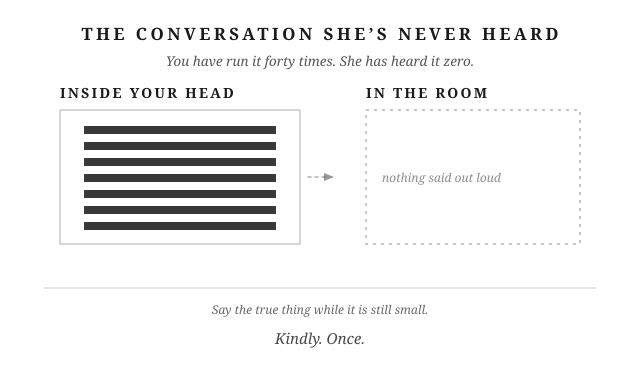</figure>

## Putting It Into Practice

1. **Reactive.** When a problem bothers you, ask whether there's a conversation or practical step you haven't tried. If there is, decide when you'll do it. If the hardship can't be ended, name the help you need to get through it. If it's a harmless difference, let it go without keeping a complaint ready for later.
2. **Reactive.** When a remark hurts you, name the remark, explain how it affected you, and ask for what you need. Then listen. If you're too angry to speak kindly, agree on a time to return to the conversation and keep it.
3. **Reactive.** When you catch yourself repeating an argument in your head, write down what you want her to understand. Ask for a time to talk instead of rehearsing her answer for her.

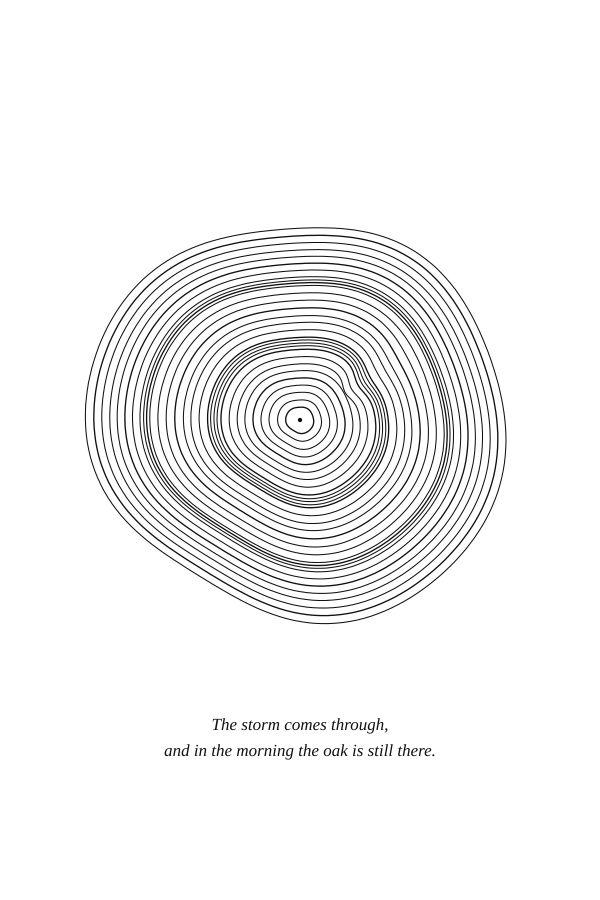

# PART III — THE WARM SUN

*The sun is warm, and it gives that warmth away. That's the whole of its work. It doesn't wait to feel like it, and it doesn't wait to be asked. It comes back every morning, whether or not anyone thanked it for yesterday. Nothing grows in the cold, however well the rest of it was built. Everything alive leans toward the light. What it reaches, opens.*

# Chapter 12: Romance Is a Discipline

The question that woke me up in my own marriage came in a normal conversation, from a woman who wasn't angry, and it had the answer sitting inside it.

Last year my wife and I hit twenty-four years married. We were talking about nothing in particular, and she asked when the last time was that I took her on a date.

It hit me like a ton of bricks, because she was right. I counted back. Close to five months, and I hadn't felt one of them go by. You've heard the same advice I have, that a couple should get out once a week. Nobody established that number. Being there is the part that counts.

She wasn't accusing me of anything. She was asking. If there's a stretch like that in your house, you probably don't know how long it is either. You didn't stop loving her. Nothing in a week tells you how long it's been.

---

**The second piece of advice.** My grandfather gave me two things worth keeping about marriage. You've already had the one about giving sixty and expecting forty. The other came when I first got married, and it was harder to take: "Put your wife first. Focus on her because your kids will leave you."

That came off as harsh. It still does. You're supposed to say your family is everything, not rank the people inside it. Here was an old man ranking them out loud to me. He's also the man whose temper I inherited. He got plenty wrong. He got this right.

I think he meant something gentler than it sounded. You pick a partner, and you keep putting her first after the house fills up with people who need you more loudly. The kids grow and go. They're supposed to. She's the one still across from you when they do, and the one who notices first when you drift.

---

**The thing with no deadline.** It makes sense that it faded, and I'd rather say why than let you think you got lazy.

Romance takes real effort, and you only have so much in a day. The more life takes out of you, the less is left over for her. So when a week gets heavy, something goes, and it's never the mortgage or the kid's game at eight on a Saturday. Those shout. They have a day attached and other people watching. Nobody calls you at work because you haven't surprised your wife since March. So romance goes, quietly, and you never catch it.

It isn't only me. My wife has gotten every bit as busy, and we've both forgotten our anniversary in a hard year. Get far enough in and you can laugh about it. We do.

You run the rest of your life on purpose. If you've read any Stoicism, you aimed it at your temper and it held. This is the one corner you never aimed at.

Epictetus was born a slave in the Roman empire, was freed, and became a teacher whose students wrote down what he said. He put it this way nineteen hundred years ago, and he wasn't talking about marriage.

*"Every habit and faculty is maintained and increased by the corresponding actions: the habit of walking by walking, the habit of running by running. If you would be a good reader, read; if a writer, write."* (*Discourses* 2.18, Long trans.)

What you keep doing, you keep. Then he turns it around. Go thirty days without reading, he says, and you'll know the consequence. Romance works like any muscle: the more you use it, the better you get at it. Leave it a while and the first honest attempt feels ridiculous. That's only what thirty days does.

---

**Her currency, not yours.** Romance is trying to win favor with your wife. It isn't about you, it's about her, with a little mystery and surprise. It runs on study, and you can't win favor with someone you stopped learning about.

Your default here is the golden rule: treat her the way you'd want to be treated. A communication researcher, Milton Bennett, named the problem with that in 1979. The golden rule quietly assumes she's built like you. People call his version the platinum rule. Treat her the way she wants to be treated, which means finding out what that is.

You've probably met the five love languages. It's a popular list rather than a science, and nobody has shown that matching hers changes anything. As a tactic rather than a philosophy it does one thing well: it makes you look at all five instead of the one you'd reach for. Touch. Saying it out loud. Doing things for her without being asked.

Mine is touch. My favorite part of a week is laying my head in my wife's lap while we watch TV and having her rub my head. That's when I feel closest to her.

Hers is acts of service. Her favorite evening is the two of us grilling together, me helping cook, a little wine, laughing and talking while the work gets done. An ordinary night with both people in it.

And acts of service is my lowest. Bringing somebody a coffee, seeing what needs doing before anyone asks. None of it occurs to me on its own. The language I'm worst at is the one she reads best. I didn't choose that, and if it's true in your house you didn't either. It still has to be done.

So your effort can be real and still land flat. You put your back into something in your own language, she thanks you and means it, and it's flat. You carry that for three days deciding she's ungrateful. She isn't. It arrived in a form she doesn't read as love. To her, love is you asking about the meeting she's been dreading, then asking again on Thursday, because you remembered there was a Thursday.

When love arrives in a form that doesn't land for you, the reflex is to overlook it. Effort in the wrong language is still effort, and you owe it a real thank you. Winning favor isn't trading for it, either.

Twenty years ago I took my wife on a short sightseeing flight over Nashville, and I wrote her letters. I haven't done anything like it since, and she's never asked for another flight. She asked about a date. What lands is the detail you kept and the question you came back to. It's the small thing that says I still see you rather than I planned something impressive.

---

**What's still there.** Couples followed over the years don't usually come apart because the fighting starts. They come apart because the warmth stops, and it stops first in the couples who've been at it longest. Partners who feel appreciated tend to be more appreciative back, and the research only says they travel together.

That sounds bleak for about four seconds. Fighting is a problem you have to solve. This is a thing you stopped doing, and starting again asks nobody's forgiveness.

If you give her the bare minimum, the bare minimum is what comes back. That isn't her being petty. That's anyone who's been getting the leftovers long enough to stop expecting better.

Marcus Aurelius ran the Roman empire and kept a notebook where he argued with himself. He was a Stoic, and the notebook is *Meditations*. In 4.24 he picks up an old line from a philosopher he doesn't name: if you want to be untroubled, do few things. Marcus corrected it. Do the necessary things instead. That list is harder to write, because it makes you say what actually counts.

---

She's been waiting to be one of the necessary things, and the muscle that puts her there is one you can start using tonight.

<figure class="plate">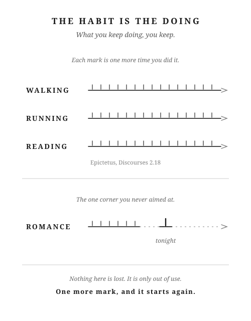</figure>

## Putting It Into Practice

1. Once a week, on a set day, ask what actually counted that week and whether anything you did was for her alone. If nothing was, the week made that call for you.
2. When she tells you about something she's dreading, write down the day it lands, and ask her about it again on that day. Coming back to it is what says you were listening.
3. Name your own lowest language out loud, and check it against hers. The one you'd never think of is usually the one she reads best.

# Chapter 13: Pursue Her After You Have Her

You can mean it when you say “love you” and still realize you haven't paid much attention to her today. You know she's there. You'd like a few minutes together, once everything else is done.

You ask how her day was. She says “fine.” You nod, finish something on your phone, and start talking about dinner. Nothing harsh passed between you. You might have that same exchange tomorrow.

Now think of a child bringing you a hand-drawn picture. You look up. You want to see it. You ask about the person beside the house, and you listen while the child explains. You're glad they wanted to show you.

You already know how to give that kind of attention. With your wife, it can be as simple as setting the phone down when she starts talking. You know her well enough to recognize when something pleased her. Let yourself be pleased for her. Ask what happened next.

There's pleasure in being the person she wants to tell.

---

**When learning felt finished.** Imagine asking your wife out after twelve years of marriage. You've got some time free, and you want to spend it with her. You start thinking about what she'd enjoy.

The place you remember is somewhere she loved when you were dating. Would she still choose it? You think about the music she liked then, the way she used to spend a free Saturday. You can describe those things. What she'd choose now takes more thought.

You live with her. How can you be unsure?

She hasn't become a stranger. You still know how she takes her coffee and which jokes will make her laugh. But at some point, you stopped asking certain questions. You kept using the answers you already had.

That's the pre-commitment paradox: you can work hard to win a woman's affection, then ease off once you're sure of it. Before commitment, you wanted to hear what she thought. You remembered what excited her because you wanted another chance to enjoy it with her. Once you were married, learning about her could start to feel finished.

It makes sense that security changes things. You can relax together. You can be quiet without wondering whether she's lost interest. That's a good part of marriage. Taking her affection for granted is a costly mistake. You can lose the easy closeness of knowing what she's looking forward to, or being the person she wants to tell first.

Winning her affection was the beginning of a life together. The effort that follows deserves just as much of you. You keep making time, asking, listening, and following through, even in the years when being married feels easy.

---

**She's still becoming.** In Letter 58 of his *Moral Letters to Lucilius*, the Stoic philosopher Seneca reflects on how people keep changing. He turns to an earlier philosopher, Heraclitus, and his image of the river: what looks familiar doesn't stay fixed. Its water keeps changing, and so do we.

Bring that thought home. Your wife has had twelve years of experiences since you married her. Some things matter more to her now. Others matter less. She may have an interest you haven't asked about, or an old ambition she's begun to reconsider.

You've changed too. You have things you could tell her that wouldn't have occurred to you when you first met. Growing together takes some willingness to share those things, and some interest in hearing hers.

Pay attention to the people you're already becoming.

The date can begin with an honest question: “What sounds fun to you these days? I've been thinking about what we used to do.” Suppose she says she'd rather spend the afternoon at a pottery class. She tried it with a friend last month and wants to go again. You knew she was out that afternoon. You hadn't asked what she'd enjoyed about it. Now you're hearing about the bowl she wants to make, and you want to see what she means. You can plan an afternoon around something she's enjoying now.

---

**Be interested in her answer.** Maybe you've started watching different shows. You listen to one podcast, she listens to another. Separate tastes can give you something to talk about. You don't need to enjoy her show to enjoy hearing why she likes it.

Ask about the part that caught her attention. If she laughs while telling you, stay with the story long enough to understand what's funny. You may discover a side of her humor you haven't seen much lately. Tell her what's been making you laugh too. Let her hear more from you than a report of what got done.

You can also try something neither of you knows much about. Choose a walk through a part of town you rarely visit. Stop when something interests her. Show her what catches your eye. Give yourselves a little time when neither person already knows what the other will say.

Curiosity becomes warmth in how you receive the answer. If she tells you something went well, pause what you're doing. Let her finish. Say what you're glad about. When you talk later, remember enough to return to it. You give her a reason to believe you enjoyed hearing from her.

The opposite can hurt without a single unkind word. You know where she'll be and what she'll handle, but little about what's been on her mind. She can feel unseen in a marriage where she's loved. If her stories keep meeting half your attention, she may tell you less. You can miss hearing from each other while sharing the same room.

You can begin with the next conversation. Then keep making room for what you learn. Ask how the bowl turned out. Find another afternoon to go with her. Remember what she enjoyed when you're making plans a month from now. That takes effort long after the first interested question.

---

**Choose her today.** Some days “fine” means fine. Some days she's tired and wants to sit beside you without talking. An invitation leaves room for either. You can ask whether she feels like telling you more, then accept her answer without making her reassure you.

Your own tired days count too. You won't greet every story with excitement. A quiet, attentive husband can be good company. Keep saying “love you.” Familiar words can carry years of meaning when your attention gives her reason to believe them.

After ten or twenty years, pursuit still asks for your time and energy. Keep learning what matters to her. Share what matters to you. You offer time together because you want her company, without requiring a particular response. Your choice to love her becomes visible again today.

The same desire to discover someone can draw your attention toward another woman, too. Pursuing your wife also calls for enjoying her without measuring her against someone else. The next chapter names how that comparison starts, and takes up the discipline of enough.

---

For now, put the phone down and turn toward her while she's still telling you about her day.

<figure class="plate">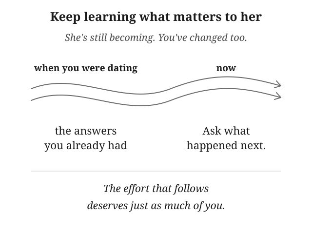</figure>

## Putting It Into Practice

1. Once a week, make time together around something she enjoys now. Ask rather than relying only on what she liked when you were dating, and follow through on the plan.
2. When she tells you about something she's enjoying, set aside what you're doing and ask what caught her interest. Let yourself be pleased for her, and return to it another day.
3. When you're spending time together, tell her about something you've begun to enjoy or reconsider. Give her a chance to know who you're becoming too.

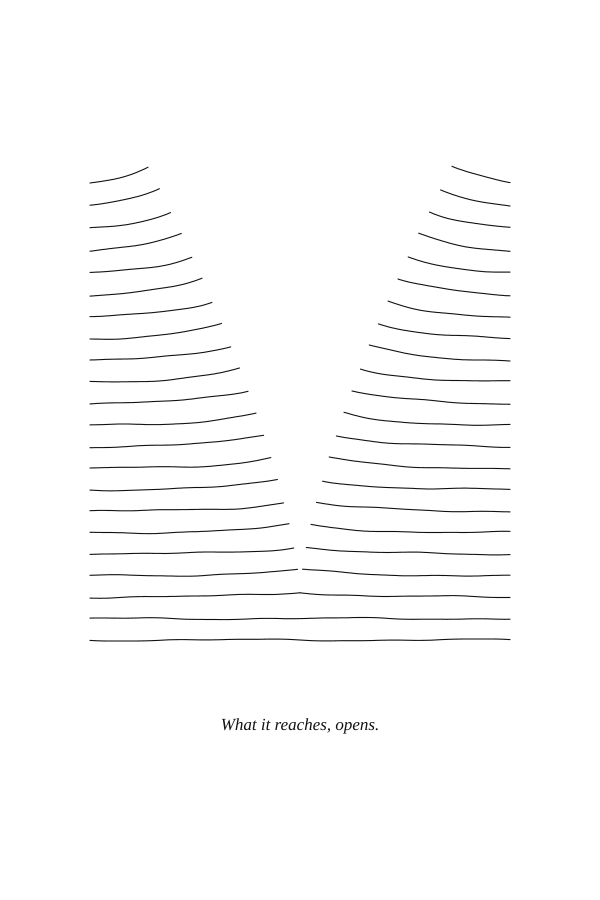

